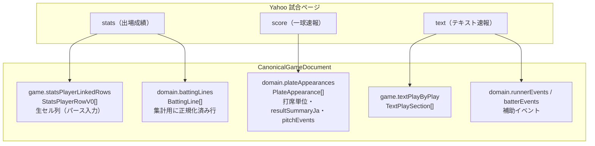

# Phase 0 成果物: 出場成績主軸の「正」と canonical 内の対応（打撃派生）

親計画: `docs/plan_batting_derived_appearance_stats_primary_phases.md`  
関連: `docs/yahoo_npb_game_data_integration_plan.md`（Phase 1 表 #6）、`docs/yahoo_plate_appearance_batting_rules.md`（§6c）

**Phase 0 の目的**: 現行 canonical に載る打撃関連フィールドの関係を固定し、**新方式での「正」**と **Phase 1 以降の突合キー案**、**現行ハイブリッド集計との差分**を文書化する。

---

## 1. 新方式での「正」（打席結果）

| レイヤ | 正とするソース（第一） | 補助・別レイヤ |
|--------|------------------------|----------------|
| 打席ごとの**成績上の結果**（公式表に近い文言・派生の土台） | **出場成績**（`domain.battingLines` および同一 stats テーブル由来の打席結果セル） | 一球ログ・実況は **検算・欠損補完**（一球のみを正にして帳票を上書きしない） |
| **球種・球速・コース** | （出場成績に無い）**一球速報** | 表示ブロックの主材料＝一球（親計画 §3 対象外のまま） |
| **得点圏・先頭球時点の走者**等 | **一球ログ／canonical 上の打席コンテキスト** | 出場成績の結果セルのみでは原則不足（親計画 §2 表） |
| **対左右（投手の左右）** | **第1**: 打席に紐づく投手 ID・`pitchEvents`。**第2**: 投手成績表の「打者」欄（Phase 1 でパース保存予定） | ログと矛盾したときの優先は Phase 0 で固定済みの親計画 §2.1 に従う |

---

## 2. canonical 内の対応関係（図）

**読み方（現状のパイプライン）**

- `battingLines` は出場成績テーブル行から **`inferredFrom: stats_row_v0`** で構築（型定義は `lib/yahooGame/types.ts`）。
- `statsPlayerLinkedRows` は **同一 stats HTML の生行**（`cells[]`）。`BattingLine` の h2/h3 等は **cells の後段（例: 14列目〜）** から推定する経路がある（型コメント参照）。
- `plateAppearances` は Phase 10 等で **一球／テキストとマージ**された打席列。`resultSummaryJa` はマージルール（`mergePhase10FromPitchRows.ts` 等）に依存。
- `canonicalBattingSeasonAgg.ts` は **同一試合で `battingLines` がある打者は行優先**し、`plateAppearances` で二重加算しないハイブリッドを実装済み（コメント「同一試合で battingLines を優先」）。

---

## 3. 投手成績「打者」欄を第2ソースにする場合の突合キー（案）

親計画 Phase 0 の要件に沿った **識別子の候補**（Phase 1 で最終確定）。

| キー | 用途 |
|------|------|
| `gameId` | 試合単位のpartition |
| イニング番号 + 表／裏 | 攻防の区切り |
| 打順（1〜9） | 出場成績列とログの横並び |
| 同一打順内の打席連番 | 代打連打・1イニング複数打席で必須になり得る |

**件数不一致時（親計画 §6.3 と同旨）**

- `N`（出場成績の打席スロット数）と `M`（ログ側で数えた打席候補）が一致しないときは **機械 zip を禁止**し、フォールバック（検証キュー／ログのみ補完／試合除外等）は Phase 1 実装時にフラグ化する。

---

## 4. 現行ハイブリッド集計との差分（Phase 2 で「主軸切替」すると変わる点）

現行の主な実装箇所: `lib/yahooGame/canonicalBattingSeasonAgg.ts`

| 項目 | 現状（概要） | 新方式完了後の狙い（親計画 Phase 2） |
|------|--------------|--------------------------------------|
| 打席結果の第一 | ハイブリッド（行優先だが `resultSummaryJa` や実況・GIDP 補完が絡む） | **出場成績の打席結果列を第一**に正規化し、ログは不足分のみ |
| 2B/3B/SF 等 | 行に無い列は `plateAppearances`・text から補完 | **打席の「決着文言」の正**は表側に寄せる |
| 盗塁死（CS） | runnerEvents・text 混在 | **一球 score 記録文 → `runnerEvents`（`sourceTier: score`）のみ**（`data_operation_rules.md` §盗塁死） |
| 検算 | ハイブリッド行と PA の reconcile パスあり | **表の打席数 N とログ側 M** の試合単位検算を必須化（親計画 §6） |

---

## 5. 完了チェック（Phase 0）

- [x] `battingLines` / `statsPlayerLinkedRows` / `plateAppearances` の関係を本文・図で固定
- [x] 新方式での「正」を表で明文化（親計画 §2 と整合）
- [x] 突合キー案と N/M 不一致時の方針を親計画 §6 に沿って記載
- [x] 現行ハイブリッドとの差分を `canonicalBattingSeasonAgg` 観点で列挙
- [ ] 投手成績「打者」欄の **実 HTML サンプルに基づく**キー確定は **Phase 1** に委譲
