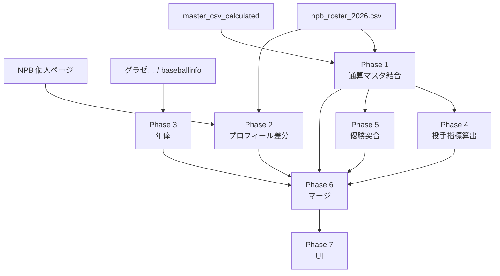

# 選手個人ページ：プロフィール表・通算成績 生成計画書

## 1. 目的とスコープ

プレイヤーページ（`app/players/[playerId]/page.tsx`）の**プロフィール表**（現行レイアウトをそのまま埋め込む）と、**通算成績**ブロック（年度別テーブル）を、2026年選手名簿に載る全選手分つくる。

| 区分 | 方針 |
|------|------|
| **対象選手** | `_data/npb_roster_2026.csv` に `name_ja` がある行＝**2026年支配下名簿の全員**（おおよそ 800 名規模） |
| **プロフィール表 UI** | 既存の 2 列テーブル（黄ラベル＋値）を**変更しない**。データだけ差し替え |
| **出身地** | **廃止**（行ごと削除。データ取得もしない） |
| **FA取得（推定）** | **本計画の対象外** |
| **NPB 完コピ項目** | 生年月日・経歴・プロ入り（公式の「ドラフト」表記） |
| **推定・外部項目** | 生涯年俸（推定）のみ。出典・推定の明記は必須 |
| **通算成績** | **既存マスタ CSV を正**とし、NPB からの**再取得はしない** |

### 1.1 再取得しない方針（固定）

リポジトリには、NPB 公式由来の**年度別成績マスタ**が既に存在する。

| 種別 | 既存データ（SSOT） | 例 |
|------|-------------------|-----|
| 打撃（年度×リーグ） | `_data/master_csv_calculated/batting_{year}_{CL\|PL}_from_master.csv` | `batting_2024_CL_from_master.csv` |
| 投手（年度×リーグ） | `_data/master_csv_calculated/pitching_{year}_{CL\|PL}_from_master.csv` | `pitching_2024_PL_from_master.csv` |
| インポート副本 | `_data/master_csv__import_1950_2024/` | 1950〜2024 付近 |

**通算成績（年度別行）**

- 上記 CSV の `player_id` で年度行を突合し、`career_batting.rows` / `career_pitching.rows` を**ローカル組み立て**する（**Phase 1**）。
- **既にマスタに載っている選手・年度について、NPB 個人ページへ通算目的で再訪問しない。**
- 通算行（`total`）はマスタに通算列があればそれを使い、無ければ **Phase 5** のマージ時に年度行から算出（方針は実装時に固定）。

**プロフィール（生年月日・経歴・ドラフト）**

- マスタ CSV には**含まれない**。
- **Phase 2** で NPB から取得するが、**未取得の選手だけ** HTTP する。

**明示的な再取得**

- 通常運用では **行わない**。
- 全件上書きが必要なときのみ `--force`（開発・障害復旧用）。

### 1.2 サイト訪問回数の原則

| データ | Phase | NPB / 外部 HTTP |
|--------|-------|-----------------|
| **通算・年度別成績** | 1 | **0 回**（マスタ結合） |
| **プロフィール** | 2 | **未取得分のみ** |
| **年俸** | 3 | 外部・未取得分のみ |
| **チーム優勝** | 4 | マスタのみ（少数 GET） |
| **マージ・UI** | 5, 6 | 0 回 |

**禁止**

- 通算がマスタにある選手に、プロフィール取得を口実に NPB で通算を取り直すこと。
- 同一選手の NPB を同一目的で 2 回以上ネットワーク取得すること（キャッシュ HTML の再パースは可）。

**プロフィール取得時の注意**

- NPB 個人ページ HTML には成績表も含まれるが、**通算の正は常にマスタ CSV**（Phase 1）。

### 1.3 プロフィール表の表示項目

| 項目 | データ源 | 備考 |
|------|----------|------|
| 生年月日 | NPB 公式 | 文言を**加工せず**埋め込み。年齢は算出可 |
| プロ入り | NPB 公式 | 「ドラフト」行をそのまま |
| 経歴 | NPB 公式 | そのまま |
| 生涯年俸 | 外部（①②） | 初年度〜2026。**推定**・出典必須 |
| チーム成績 | 優勝マスタ＋在籍年突合 | 任意 |

**削除**: 出身地、FA取得（推定）

### 1.4 通算成績の表示範囲

- **野手**: マスタ打撃 CSV を `player_id` で縦結合 → 年度別行。
- **投手**: マスタ投手 CSV を同様に結合。**Phase 6** で投手表 UI に差し替え。
- **年俸列**: **Phase 3** の `salary_by_year` を JOIN。
- **年度行**: 一軍記録のある年のみ（全員が 2024 行を持つ必要はない）。

### 1.5 2026年・新規選手

- **2026 年度行**: 既存 scrape で `batting_2026_*_from_master.csv` が揃ったら **Phase 1 を再実行**（NPB 個人ページは使わない）。
- **マスタ未登録の新人**: **Phase 2** でプロフィールのみ NPB。成績は年度マスタ追補後に Phase 1 へ。

---

## 2. Phase 一覧

本計画の **Phase 番号は 1, 2, 3 … の自然数のみ**とする（1a / 1b 等の副番号は使わない）。

| Phase | 名称 | HTTP | 主な成果物 |
|-------|------|------|------------|
| **1** | 名簿固定 + 通算（マスタ結合） | **0** | `_targets_2026.json`、`career_from_master/{id}.json` |
| **2** | プロフィール（NPB・未取得のみ） | NPB・差分のみ | `profile_npb/{id}.json` |
| **3** | 年俸・生涯合算 | 外部・差分のみ | `player_salary/{id}.json` |
| **4** | 投手指標（表示順固定） | **0** | 投手の派生指標（ERA/WHIP/K-BB%/K%/BB%）を算出し merged に格納 |
| **5** | チーム成績（任意） | マスタのみ | `team_titles_by_year.json` |
| **6** | マージ・検証 | **0** | `merged/{id}.json` |
| **7** | UI 接続 | **0** | プロフィール表・通算タブ |

---

## 3. Phase 1：名簿固定 + 通算（マスタ結合）

### 3.1 名簿・ID

1. `_data/npb_roster_2026.csv` を SSOT。
2. `_data/player_profile/_targets_2026.json` を生成。
3. サイト `playerId` = `npb_player_id` を推奨。

### 3.2 通算成績（NPB 再取得なし）

**スクリプト（案）**: `scripts/build_player_career_from_master.py`

**入力**: `_data/master_csv_calculated/batting_*_from_master.csv`、同 `pitching_*`、必要なら `_data/master_csv__import_1950_2024/`

**処理**

1. 名簿の各 `npb_player_id` について、全年度 CSV から `player_id` 一致行を収集。
2. `year` 昇順で `career_batting.rows` / `career_pitching.rows` を構築。
3. CSV 列を個人ページ用スキーマへマッピング。
4. `player_id` の表記ゆれ（`01705138` vs `1705138`）を正規化。

**出力**

- `_data/derived/player_profile/career_from_master/{npb_player_id}.json`
- `_reports/player_profile_phase1_career_missing_in_master.csv`

**完了条件**

- 名簿の **90% 以上**で 1 行以上の年度データがある。
- **NPB への HTTP リクエストが 0 件**。

---

## 4. Phase 2：プロフィール（NPB・未取得のみ）

**スクリプト（案）**: `scripts/fetch_npb_player_profile.py`

**スキップ条件**（**GET しない**）

- `profile_npb/{npb_player_id}.json` が存在し、生年月日・ドラフト・経歴が揃っている。
- またはキャッシュ HTML からローカル再パースで足りる。

**取得時**（1 選手あたり最大 1 GET）

```
GET bis/players/{npb_player_id}.html
  → profile のみ保存（通算は Phase 1 を正とする）
```

| フィールド | NPB ラベル |
|------------|-----------|
| `birth_date_raw` | 生年月日 |
| `pro_debut_raw` | ドラフト |
| `career_raw` | 経歴 |

**出力**: `profile_npb/{npb_player_id}.json`、任意で `_data/cache/npb_player_page/{id}.html`

**完了条件**

- プロフィール 3 項目が **95% 以上**で非空。
- `--force` 無しで、通算更新目的の NPB GET が **0 件**。

**例（小園海斗）**: 通算は Phase 1 のマスタのみ。プロフィール JSON が無いときだけ NPB **1 回**。

---

## 5. Phase 3：年俸・生涯合算（推定）

- 初年度〜2026。① [グラゼニ](https://www.gurazeni.com/player/1657) ② [ベースボールinfo](https://baseballinfo.net/player/W1D1p6YN)。
- `player_salary/{id}.json` がある選手は再取得しない（`--force` 除く）。
- 初年度は Phase 2 の `pro_debut_raw` から判定。

### 5.1 2026チーム別一覧からの上書き取得（優先）

誤マッチ（同姓同名・部分一致）を避けるため、**グラゼニの 2026 チーム別ページ**（`https://www.gurazeni.com/team`）から作ったマップを優先して `gurazeni_id` を解決し、年俸を取得して上書きする。

- **前提**: `scripts/build_gurazeni_team_map.py` で `gurazeni_team_2026_map.json` と `salary_site_map.csv` を更新済みであること
- **取得方針（安全策）**:
  - 原則 `gurazeni_team_2026_map`（チーム別名簿）→ `salary_site_map.csv` の `gurazeni_id` を利用
  - **日本人名の検索による `gurazeni_id` 解決（部分一致）は禁止**（誤マッチを避ける）
  - 外国人名（カタカナ/英字/記号を含む）は補助的に検索を許可（別名・略称が多いため）
- **上書き**: `--force` で `player_salary/{id}.json` を上書きして最新にする（キャッシュHTMLは再利用可）

---

## 6. Phase 4：投手指標（表示順固定・計算が必要）

取得した投手の年度別成績は、投手ランキング実装で定義した **1〜25 の指標順**に従って表示する（順番固定）。

**計算が必要な指標**

- ERA
- K-BB%
- WHIP
- K%
- BB%

→ いずれも `career_pitching.rows` の生値（ER, IP, BF, SO, BB, H 等）から算出する。

---

## 7. Phase 5：チーム成績（任意）

- `team_titles_by_year.json` と Phase 1 の年度別 `team` で突合。
- 選手ごとの NPB 再訪問は不要。

---

## 8. Phase 6：マージ・検証

**出力**: `_data/derived/player_profile/merged/{npb_player_id}.json`

### 8.0 年俸の年度 JOIN（成績テーブル右端）

通算成績テーブルの **各年度行の一番右に「年俸」列**を追加するため、Phase 6 のマージで **`career_*_rows.year` と `salary_by_year[year]` を JOIN** して UI がそのまま描画できる形にする。

- **入力**:
  - `career_from_master/{id}.json`（年度別成績: `career_batting.rows` / `career_pitching.rows`）
  - `player_salary/{id}.json`（`salary_by_year`）
- **出力（例）**:
  - `career_batting.rows[*].salary_yen`（数値, 円）
  - `career_pitching.rows[*].salary_yen`（数値, 円）
  - `career_batting.total.salary_yen` / `career_pitching.total.salary_yen` は **NULL（通算は年度と一致しないため）**
- **年ズレ検出**:
  - 成績側にある年なのに `salary_by_year` に無い、またはその逆（`salary_by_year` にある年が成績側に無い）を **不一致として記録**し、`_reports/player_profile_salary_year_mismatch.csv` に出力する

### 8.1 野手：通算合計行（total）と表示用指標を算出（計算が必要）

UI で表示したい指標（OPS / IsoP / BB% 等）は、Phase 1 の年度別行（マスタ由来）から **Phase 6 のマージ時に派生値として算出し、merged に格納**する。

- **入力**: `career_from_master/{id}.json` の `career_batting.rows`
- **出力**:
  - `career_batting.total`（通算合計行）
  - `career_batting.rows[*]` は Phase 1 の年度別行を保持（必要に応じて丸め）
- **注意**: 小数の丸め・0除算・欠損値の扱いは Phase 6 実装で固定する（UI 側に計算ロジックを持たせない）

**通算（`career_batting.total`）に入れる指標（表示順固定）**

OPS, 打率, 安打, 本塁打, 打点, 試合, 打席, 打数, 単打, 二塁打, 三塁打, 得点, 出塁率, 長打率, 四球, 敬遠, 死球, 三振, 塁打, 盗塁, 盗塁死, 犠打, 犠飛, 併殺打, IsoP, IsoD, BB%, K%, BB/K, RC, XR, BABIP, SecA, TA, NOI, GPA

### 8.2 投手：通算合計行（total）と派生指標を算出（計算が必要）

- **入力**: `career_from_master/{id}.json` の `career_pitching.rows`
- **出力**: `career_pitching.total`（通算合計行）＋ 派生指標（ERA / WHIP / K-BB% / K% / BB% / WPCT）
- **備考**: IP は「投球回（x.y で y は 0/1/2）」を outs に変換して合算し、通算 IP に戻す

```json
{
  "npb_player_id": "01705138",
  "name_ja": "小園 海斗",
  "profile": {
    "birth_date_display": "2000年6月7日（26歳）",
    "pro_debut_raw": "2018年ドラフト1位",
    "career_raw": "報徳学園高",
    "total_salary_display": "…（推定・出典: グラゼニ）",
    "championships_display": "日本一：0回、リーグ優勝：0回"
  },
  "career_batting": { "rows": [], "total": {}, "source": "master_csv" },
  "career_pitching": null,
  "salary_by_year": {},
  "meta": {
    "career_built_from": "master_csv_calculated",
    "profile_source": "NPB_OFFICIAL"
  }
}
```

**検証**: `verify_player_profile_coverage.ts` — 名簿全員に merged があるか、意図しない NPB GET が無いか。

**npm（案）**

```json
"player-profile:phase1": "python scripts/build_player_career_from_master.py",
"player-profile:phase2": "python scripts/fetch_npb_player_profile.py",
"player-profile:phase3": "python scripts/fetch_player_salary.py",
"player-profile:phase6:merge": "tsx scripts/merge_player_profile.ts",
"player-profile:build:2026": "npm run player-profile:phase1 && npm run player-profile:phase2 && npm run player-profile:phase3 && npm run player-profile:phase6:merge"
```

（Phase 4 は merge 内のローカル処理に含めてよい。）

---

## 9. Phase 7：UI 接続

1. 出身地・FA の `<tr>` を削除。
2. `playerData` / `careerStats` 定数 → `merged` 読込。
3. 通算は `career_batting.rows` / `career_pitching.rows`（マスタ由来）。
4. 年俸列は `rows[*].salary_yen` を最右列に表示（通算行は "—"）。

### 8.1 野手成績：表示指標（順番固定）

取得した野手の年度別成績は、以下の指標を **この順番どおり**に表示する（Phase 5 で計算済みの値を使う）。

1. OPS
2. 打率
3. 安打
4. 本塁打
5. 打点
6. 試合
7. 打席
8. 打数
9. 単打
10. 二塁打
11. 三塁打
12. 得点
13. 出塁率
14. 長打率
15. 四球
16. 敬遠
17. 死球
18. 三振
19. 塁打
20. 盗塁
21. 盗塁死
22. 犠打
23. 犠飛
24. 併殺打
25. IsoP
26. IsoD
27. BB%
28. K%
29. BB/K
30. RC
31. XR
32. BABIP
33. SecA
34. TA
35. NOI
36. GPA

---

### 9.1 投手成績：表示指標（順番固定）

取得した投手の年度別成績は、以下の指標を **この順番どおり**に表示する（Phase 4/6 で計算済みの値を使う）。

1. ERA
2. K-BB%
3. WHIP
4. W
5. L
6. G
7. IP
8. SV
9. BF
10. H
11. HR
12. BB
13. IBB
14. HBP
15. SO
16. ER
17. R
18. HOLD
19. HP
20. CG
21. SHO
22. WPCT
23. K%
24. BB%
25. WP

## 10. データフロー



---

## 11. リスクと対処

| リスク | 対処 |
|--------|------|
| マスタと名簿の ID 不一致 | ID 正規化・手動マップ |
| マスタに無い新人 | Phase 1 レポート。成績は年度マスタ追補後に Phase 1 再実行 |
| プロフィール未取得 | Phase 2 のみ NPB 1 GET/人 |
| 2026 年度がマスタ未更新 | scrape で CSV 更新 → Phase 1 再実行 |
| 誤って全件 NPB 再取得 | 既定はスキップ、`--force` のみ |

---

## 12. 既存ドキュメントとの関係

| ドキュメント | 関係 |
|--------------|------|
| `docs/投手ランキングページ作成のための報告書.md` | 年度別マスタの取得方針。個人通算は CSV 再利用 |
| `docs/player_profile_generation_plan.md` | 参考。FA 対象外・通算再取得なし |
| `lib/csvReader.ts` | マスタ CSV 読込の参考 |

---

## 12. 改訂履歴

| 日付 | 内容 |
|------|------|
| 2026-05-27 | 初版 |
| 2026-05-27 | NPB 1 GET/人、FA 除外 |
| 2026-05-27 | 通算は master CSV 正・NPB 再取得なし |
| 2026-05-27 | **Phase を自然数 1〜6 のみに整理**（1a/1b 廃止。通算=1、プロフィール=2 に分割） |
