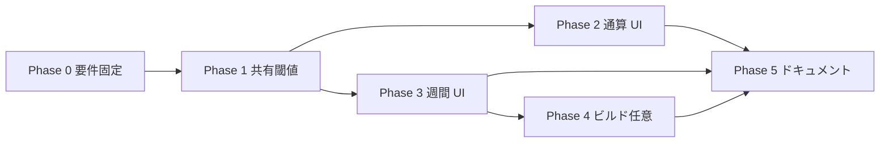

# ランキング規定（打席・投球回）— 今週・通算 Phase 計画書

**作成**: 2026-05-21  
**最終更新**: 2026-05-21（Phase 0 改定: チーム試合数＝取得試合数・canonical。初版の JSON max は撤回）  
**関連**: [`plan_ranking_qualifying_phase0_spec.md`](plan_ranking_qualifying_phase0_spec.md)、[`plan_top_weekly_phase0_spec.md`](plan_top_weekly_phase0_spec.md) §4、[`QUALIFYING_PA_METRICS.md`](QUALIFYING_PA_METRICS.md)

---

## メイン趣旨（本計画の中心）

**2026 年シーズン**のランキング（通算・今週）において、**球団ごとに次の 3 つを区別して扱う**ことが本計画の主目的である。

| # | 区別するもの | 意味（2026） |
|---|--------------|--------------|
| 1 | **チーム試合数** `teamGames(team)` | **取得試合数**: 一括取得で **canonical まで入った試合**を球団別に数えた本数（通算＝2026 累計、週間＝当該週）。**選手行の max(`games`) は Phase 0 改定で撤回** |
| 2 | **規定打席** `minPA(team)` | `teamGames(team) × 3.1`（2026 は四捨五入）。**所属球団ごとに閾値が違う**。 |
| 3 | **規定投球回** `minIp(team)` | `teamGames(team) × 1.0`（十進）。**所属球団ごとに閾値が違う**。 |

**やりたいこと**

- 試合消化が遅い球団の選手は **低い minPA / minIp** で率系ランキングに載る。
- 消化が進んだ球団の選手は **高い minPA / minIp** が必要。
- リーグ全体で 1 つの規定値（例: 全員 443 打席）に **揃えない**（2026 でチーム別データが取れるとき）。

**やらないこと（本計画の主スコープ外）**

- 1950 年代〜の歴史年度の AB 特例・チーム別固定表の再設計（既存 `calculateMinPA` は温存、2026 の動的経路とは分離）。
- 2025 年以前のランキングページへの横展開（将来 Phase で可）。

**対象画面（2026）**

- 通算: `/ranking/2026/{CL|PL}`、`/ranking/pitching/2026/{CL|PL}`
- 週間: `/ranking/weekly/2026/...`、`/ranking/pitching/weekly/2026/...`
- トップ: 2026 の TOP タブ・今週タブ

---

## ゴール（サブ）

1. 上記 **チーム別 3 値**を、率・指標系ランキングのフィルタに一貫適用する（カウント系は対象外）。
2. **新規の外部 HTTP 取得は増やさない**。`teamGames` は Phase 12/19/28 が **既に読んでいる canonical** から球団別に数え、静的 JSON に書き出す（ランキング指標 JSON とは別ファイル）。
3. 通算と週間で **係数（3.1 / 1.0）は同じ**。**試合数を数える期間だけ**通算 vs 当週で分ける。
4. **一括取得**（`daily:npb-pipeline` → canonical 更新 → Phase 12/19/28）のたびに **球団別試合数 JSON が更新**され、規定打席・規定投球回も追随する。

---

## 2026・チーム別の 3 値（確定ルール）

### 計算式（2026）

| 区分 | 式（2026） | 適用 |
|------|------------|------|
| チーム試合数 | `teamGames(team)` = **canonical から数えたその球団の試合数**（下記 SSOT） | 6 球団それぞれ独立 |
| 規定打席 | `minPA(team) = round(teamGames(team) × 3.1)` | 率系打撃のみ |
| 規定投球回 | `minIp(team) = teamGames(team) × 1.0` | 率系投球のみ |

カウント系（安打・本塁打・勝利・セーブ等）は **規定フィルタなし**。

### チーム試合数の正（SSOT）— 一括取得の canonical

**使うもの（正）**

| 項目 | 内容 |
|------|------|
| 入力 | `loadCanonicalGamesMergedForDerivedPipeline`（Phase 12 / 19 / 28 と **同一**。追加スクレイプなし） |
| 集計 | 2026 年度の各試合について、スコアボード／`game.teams` から **対戦両球団**を特定し、**実施済み試合**として各球団のカウントを +1 |
| リーグ | `leagueBucketForTeamShort` 等、Phase 12 と同じ略称・CL/PL 振り分け |
| 出力（通算） | `public/data/rankings/2026/{CL\|PL}/team-games.json` |
| 出力（週間） | `public/data/rankings/weekly/2026/{weekKey}/{CL\|PL}/team-games.json` |

**出力 JSON 形（案）**

```json
{
  "schemaVersion": "ranking-team-games-v1",
  "year": "2026",
  "league": "CL",
  "generatedAt": "2026-05-21T12:00:00.000Z",
  "source": "canonical",
  "teams": {
    "巨人": 26,
    "阪神": 26,
    "広島": 24,
    "ヤクルト": 27
  }
}
```

ランキング UI・規定フィルタは **この `teams` を読む**。`minPA` / `minIp` は表示時または Phase 1 モジュールで `teams` から算出。

**使わないもの（2026 の主経路では禁止）**

| 誤った代理 | 理由 |
|------------|------|
| ランキング JSON 内の **選手 `games` のチーム別 max** | 出場試合であり **球団の消化試合数ではない**。主力が休むと過小、控えだけだと過大になりうる |
| `config/games_per_team_by_season.json` の **リーグ一律 143** | 球団別の消化差を表せない |
| `calculateMinPA(2026, league)` の **443 一律** | 同上 |

**フォールバック（最後の手段のみ）**

1. `team-games.json` が無い・当該チームキーが無い  
2. → 開発時警告ログ  
3. → 選手行 max またはリーグ一律（Phase 1 でログ＋監視）

### 2026 通算の例（canonical 集計後のイメージ）

消化差がある時点の CL（**取得試合数**を canonical で数えた場合の例。初版の OPS.json 選手 max とは一致しない場合あり）:

| チーム | teamGames（canonical） | minPA | minIp |
|--------|------------------------|-------|-------|
| 広島 | 24 | 74 | 24.0 |
| DeNA | 25 | 78 | 25.0 |
| 阪神・中日・巨人 | 26 | 81 | 26.0 |
| ヤクルト | 27 | 84 | 27.0 |

全球団が同じ消化数の時期だけ minPA / minIp が一致する。

### パイプラインへの載せ方（追加 HTTP なし）

| 順 | 既存処理 | 追加 |
|----|----------|------|
| 派生 | canonical 更新済み | （変更なし） |
| Phase 12 | 打撃ランキング JSON | **同じ `docs` 読込後**に CL/PL ごと `team-games.json`（シーズン通算）を書く |
| Phase 19 | 投球ランキング JSON | 同上（通算は 1 ファイルで打撃・投球共用可） |
| Phase 28 | 週間ランキング JSON | **同じ `docs` 読込後**に `weekKey`×リーグの `team-games.json`（週内試合のみカウント） |

`npm run daily:npb-pipeline` の末尾まで回れば、**指標 JSON と球団別試合数 JSON が同じ鮮度**になる。

### 歴史年度

2008 年以前の `floor` や AB 特例は **2026 とは別経路**。2026 の受け入れ判定には含めない。

### Phase 0 → ✅ 完了（初版 + 改定）

詳細・履歴: [`plan_ranking_qualifying_phase0_spec.md`](plan_ranking_qualifying_phase0_spec.md)（**§0.2 初版と改定**、§9 改定ログ）

| 項目 | Phase 0 での決定 |
|------|------------------|
| 打席の丸め | **2009+ `round`、以前 `floor`**（初版で確定・維持） |
| 投球回の比較 | 十進 `ip`（維持） |
| 週間の率系 | **規定あり**（初版で確定・維持） |
| **チーム試合数** | **改定で確定**: 一括取得 **canonical の球団別取得試合数**（初版の「JSON 選手 max」は **撤回**） |

---

## 現状サマリ

| 画面 | 打撃 | 投球 | 備考 |
|------|------|------|------|
| 通算 `/ranking/2026/{リーグ}` | 率系: **`team-games.json` 優先**（無いときのみ行 max フォールバック） | 同上 | Phase 12 ビルドで JSON 生成が必要 |
| 週間 `/ranking/weekly/...` | 率系: **当週 `team-games.json` 優先** | 同上 | Phase 3 実装済み |
| トップ今週タブ | 週別 canonical + 規定（`weekKey`） | 同上 | `weeklyLeadersSnapshotBuild.ts` |
| 週間 JSON 生成 | `pa > 0` の週行のみ | 登板実績の週行のみ | Phase 28・再集計禁止 |

**2026 通算**はチーム別 Map の実装あり（要 Phase 1 共通化・フォールバック削減）。**2026 週間**は Phase 3 で同じチーム別 3 値を適用する。

---

## 指標の要否（変更なし・参照のみ）

- 打撃: `METRICS_REQUIRE_QUALIFYING_PA` / `METRICS_NO_QUALIFYING_PA`（`lib/ranking/qualifyingPA.ts`）
- 投球: `RATE_KEYS`（`lib/ranking/qualifyingPitching.ts`）
- 詳細一覧: [`QUALIFYING_PA_METRICS.md`](QUALIFYING_PA_METRICS.md)

---

## Phase 0 — 要件固定・用語・SSOT ✅ 完了（2026-05-21、§0.2 改定込み）

**成果物**

- [`plan_ranking_qualifying_phase0_spec.md`](plan_ranking_qualifying_phase0_spec.md)（**初版 + 改定**を §0.2 / §9 に記録）
- [`QUALIFYING_PA_METRICS.md`](QUALIFYING_PA_METRICS.md)
- 初版: `minPAFromTeamGames`、週間規定方針、指標要否
- 改定: **チーム試合数 = 取得試合数（canonical）**、`team-games.json` を SSOT と明記

**Phase 0 初版で決めたが改定で撤回したもの**

- ~~`teamGames` = ランキング JSON の選手 `games` チーム別 max~~ → **canonical 球団別カウント**

**受け入れ条件（改定後の Phase 0 全体）**

- [x] 週間の率系にも規定（初版）
- [x] 打席丸め 2009+ `round`（初版）
- [x] **チーム試合数は一括取得 canonical の取得試合数**（改定・本計画の正）
- [x] canonical → `team-games.json` → UI（**Phase 1 実装済み**。JSON は `npm run phase12:build:rankings` で生成）

---

## Phase 1 — canonical 球団別試合数 + 規定閾値 SSOT（2026）— 実装済み（2026-05-21）

**状態**: コード完了。`public/data/rankings/2026/{CL|PL}/team-games.json` は Phase 12 実行後に配置される。

**目的**: 一括取得済み **canonical** から **球団別試合数**を数え、そこから **規定打席・規定投球回**を導出する。本計画のメイン趣旨の実装核。

### 1-A. 集計（ビルド時・canonical）

**新規（案）**: `lib/yahooGame/aggregateTeamGamesFromCanonical.ts`

| 関数 | 説明 |
|------|------|
| `aggregateSeasonTeamGamesFromCanonical(docs, year)` | シーズン通算・CL/PL 別 `Record<teamShort, number>` |
| `aggregateWeeklyTeamGamesFromCanonical(docs, weekKey)` | 火曜始まり週に含まれる試合のみ・CL/PL 別 |

- 試合のカウント条件: 中止以外で canonical にスコア／チーム情報がある試合（詳細は実装時に `docs/data_operation_rules.md` と整合）。
- チームキー: `CSV_TEAM_TO_RANKING_SHORT`（Phase 12 と同じ略称）。

**書き込み**

- `scripts/phase12_build_rankings_from_phase11.ts` 末尾で `team-games.json` 出力
- `scripts/phase19_build_pitching_rankings_from_canonical.ts` は共通化または phase12 に任せる
- `lib/ranking/buildWeeklyRankingsFromPeriod.ts`（Phase 28）で週別 `team-games.json` 出力

### 1-B. 読み取り・規定（ランタイム）

**新規（案）**: `lib/ranking/qualifyingThresholds.ts`

| 関数 | 入力 | 出力 |
|------|------|------|
| `loadTeamGamesJson(year, league, weekKey?)` | 静的パス | `{ teams: Record<string, number> }` |
| `thresholdsFromTeamGames(teams, year)` | 球団別試合数 | `Map<team, { teamGames, minPA, minIp }>` |
| `rowPassesQualifyingPA` / `rowPassesQualifyingIp` | 行 + Map | boolean |

**移行（2026）**

- `computeDynamicMinPAByTeam(rows)` … **非推奨**。`team-games.json` 優先。行 max はフォールバックのみ。
- `computePitchingQualifyingMinIpByTeam(rows)` … 同上。
- 通算・週間・トップリーダーは **`loadTeamGamesJson` → `thresholdsFromTeamGames`** に統一。

**データ取得**: 追加 HTTP なし（既存 `public/data/rankings/.../team-games.json` を fetch。Phase 12/28 ビルドで更新）。

---

## Phase 2 — 2026 通算ランキング（打撃・投球）— 実装済み（2026-05-21）

**目的**: 2026 通算で **6 球団×CL/PL それぞれ異なる minPA / minIp** が率系に効いていることを UI 上も確認できるようにする。

**対象ファイル**

- `app/ranking/[year]/[league]/RankingPageClient.tsx`
- `app/ranking/pitching/[year]/[league]/PitchingRankingPageClient.tsx`
- `lib/ranking/leadersFromRankingsJson.ts` / `leadersFromPitchingRankingsJson.ts`（トップ通算タブ）

**作業**

1. 率系ソート時に Phase 1 のフィルタを適用（挙動は現状維持が基本）。
2. 率系選択時、`titleSubNote` に **「2026: 規定は所属球団の試合消化数に応じて異なります（×3.1 打席 / ×1.0 投球回）」** を表示。
3. （任意）デバッグ用に、ホバーまたは開発時ログで `teamGames` / `minPA` / `minIp` をチーム別に確認可能にする。
4. 1966/67 PL 等の歴史特例は温存。**2026 の受け入れには含めない**。

**受け入れ条件（2026）**

- [x] 率系で `team-games.json` → チーム別 `minPA` / `minIp` フィルタ（UI・リーダー）
- [x] 率系選択時 `titleSubNote` 表示（`lib/ranking/qualifyingUiNotes.ts`）
- [ ] CL・PL 各 6 球団で `teamGames` が異なることを JSON で確認（要 `phase12:build:rankings`）
- [ ] トップ 2026 通算リーダーとランキング表の率系上位が一致（手動確認）

---

## Phase 3 — 2026 週間ランキング（打撃・投球）— 実装済み（2026-05-21）

**目的**: 2026 週間でも **当週のチーム別 `teamGames` → minPA / minIp`** を率系に適用する（通算と同型・期間のみ週）。

**対象**

- `app/ranking/weekly/.../WeeklyRankingPageClient.tsx`
- `app/ranking/pitching/weekly/.../WeeklyPitchingRankingPageClient.tsx`
- `lib/ranking/leadersFromRankingsAtLeagueDir.ts`（`skipQualifyingFilters` の見直し）
- トップ今週タブ: `TopPageWeeklyTabContent` 経由のリーダー抽出

**週間の `teamGames`**

- Phase 28 が canonical から数えた **`.../weekly/2026/{weekKey}/{CL|PL}/team-games.json`** を正とする（通算と同じ集計ロジック・期間のみ週）。
- 選手行の週間 `g` の max は **使わない**。

**`skipQualifyingFilters`**

- 週間リーダー（トップ今週）: **false に変更**し、通算と同じ率系フィルタを適用。
- カウント系週間指標: 引き続き規定なし（週間でも上位 N 件の既存制限があれば維持）。

**UI**

- `titleSubNote` を「週間成績（通算の規定は適用しません）」から  
  「週間成績（規定: 当週の所属球団試合数 × 3.1 / × 1.0）」へ変更。

**受け入れ条件（2026）**

- [x] 週間 UI: `fetch*Client(..., weekKey)` + 率系フィルタ + `titleSubNote` 更新
- [x] トップ今週タブ: `buildBatting/PitchingLeadersConfigAtLeagueDir(..., { weekKey })` で規定適用
- [ ] 当週 `team-games.json` の中身確認（要 `phase28:build:weekly-rankings`）
- [ ] 個人ページの同一 `weekKey` 行とカウント一致（手動確認）

---

## Phase 4 — ビルドパイプライン — 実装済み（2026-05-21）

**目的**: ブラウザが読む前に、2026 の率系 JSON を規定到達者に絞る（パフォーマンス・一貫性）。クライアントフィルタ（Phase 2–3）は後方互換として維持。

**実装**（`lib/ranking/filterRankingsByQualifyingAtBuild.ts`）

| 出力 | 内容 |
|------|------|
| `{metric}.json` | 2026・率系のみ canonical `teamGames` で絞り込み後に `rank` 付与 |
| `{metric}_all.json` | 通算のみ・全選手（カウント系・参照用） |
| 週間 `{metric}.json` | 当週 `teamGames` で率系のみ絞り込み（`_all` なし） |

**組み込み**: Phase 12 / Phase 19 / Phase 28（`team-games` と同一 canonical 集計をビルド時に使用）。

---

## Phase 5 — ドキュメント・運用・テスト — 実装済み（2026-05-21）

**更新ドキュメント**

- [x] [`plan_top_weekly_phase0_spec.md`](plan_top_weekly_phase0_spec.md) §4（週間規定・実装済み）
- [x] [`QUALIFYING_PA_METRICS.md`](QUALIFYING_PA_METRICS.md)（週間・ビルド・モジュール一覧）
- [x] [`DATA_PATHS.md`](DATA_PATHS.md)（`team-games.json`・`_all.json`・検証コマンド）
- [x] [`data_operation_rules.md`](data_operation_rules.md)（パイプライン表 11–14）

**自動検証**

```bash
npm run validate:ranking-qualifying-2026
npm run validate:ranking-qualifying-2026:fail   # エラー時 exit 1
```

`scripts/validate_ranking_qualifying_2026.ts` — `team-games.json` の存在、球団別 `minPA`/`minIp` 表示、OPS/防御率 JSON が規定を満たすこと、週間サンプル週をチェック。

**手動受け入れ（ビルド後）**

| ケース | 期待 |
|--------|------|
| 通算・打率・試合数が遅れている球団 | その球団選手は minPA が小さく、早い球団より除外されやすい |
| 週間・OPS・週 6 試合球団 | minPA ≈ `round(6×3.1)` = 19（2026 は四捨五入） |
| 投手・防御率・先発 1 登板 | チーム週 6 試合なら minIp=6、1 登板は除外 |
| 安打・勝利 | 規定フィルタなし |

**パイプライン**

- 一括: `npm run rankings:rebuild`（Phase 12/19/28 + top-leaders + top-weekly-leaders）
- 日次: `daily:npb-pipeline` 末尾の `rankings:rebuild` と同順

---

## 依存関係（Phase 間）



---

## リスク・注意点（2026 中心）

1. **選手行 max を使い続ける**: 球団消化数とズレる → Phase 1 で canonical `team-games.json` に置換。
2. **`team-games.json` 未生成**: Phase 12/28 を忘れるとフォールバック → `data_operation_rules.md` 手順 11–12 と `validate:ranking-qualifying-2026` で検知。
3. **全球団同じ teamGames**: 日程上同数なら minPA / minIp も同じ（仕様どおり）。
4. **歴史年度**: 本計画の主目的外。2026 実装を壊さないよう分岐を維持。

---

## 実装優先度（推奨）

| 順 | Phase | 2026・チーム別区別の観点 |
|----|-------|-------------------------|
| 1 | Phase 0 | ✅ 2026 の式・週間方針を固定 |
| 2 | Phase 1 | **チーム別 3 値 Map の SSOT**（本丸） |
| 3 | Phase 2 | 2026 通算で区別が効くことを確認・フォールバック削減 |
| 4 | Phase 3 | 2026 週間・今週タブで同じ区別 |
| 5 | Phase 5 | 2026 受け入れテストの記録 |
| 6 | Phase 4 | 任意 |

---

## 関連コード（現状の参照先）

| 役割 | パス |
|------|------|
| 打撃・率系要否 | `lib/ranking/qualifyingPA.ts` |
| 投手・率系要否 | `lib/ranking/qualifyingPitching.ts` |
| 閾値 SSOT | `lib/ranking/qualifyingThresholds.ts` |
| ビルド時絞り込み | `lib/ranking/filterRankingsByQualifyingAtBuild.ts` |
| フォールバック minPA | `lib/ranking/dynamicQualifyingPA.ts` |
| 週間 JSON | `lib/ranking/buildWeeklyRankingsFromPeriod.ts` |
| 受け入れ検証 | `scripts/validate_ranking_qualifying_2026.ts` |
