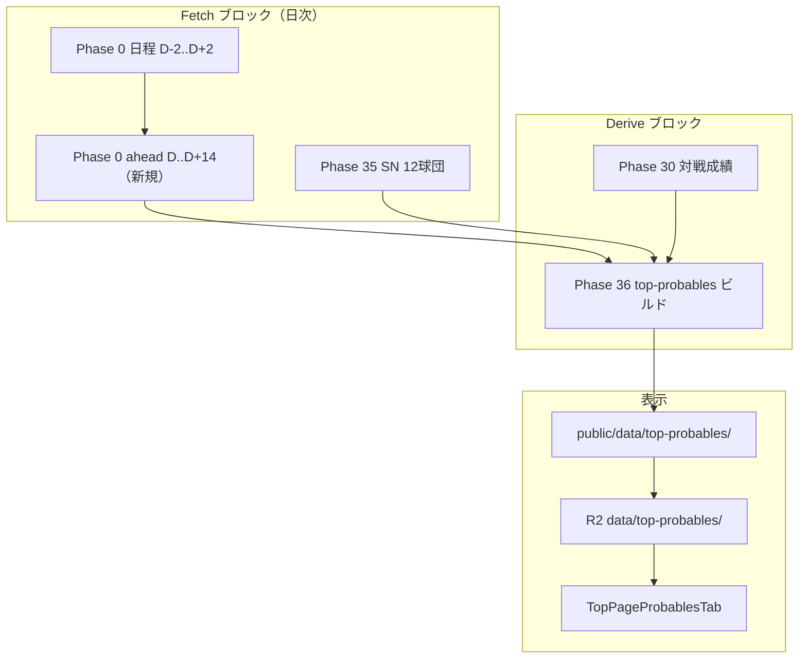
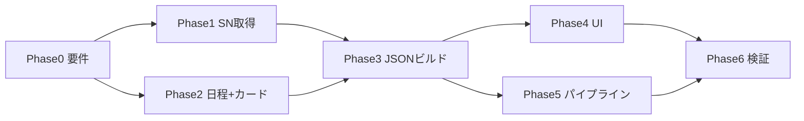

# トップページ「予想投手」タブ — Phase 計画書

> **Phase 0**: 未着手 — 要件確定書 [`plan_top_probables_phase0_spec.md`](plan_top_probables_phase0_spec.md)

**関連**: 個人ページ対戦成績 [`plan_player_matchup_stats_phases.md`](plan_player_matchup_stats_phases.md)（Phase 30） · 日程取得 [`plan_sportsnavi_schedule_ingest_2026.md`](plan_sportsnavi_schedule_ingest_2026.md) · 運用 [`data_operation_rules.md`](data_operation_rules.md) · 表示 R2 [`plan_display_data_r2_unified_phases.md`](plan_display_data_r2_unified_phases.md)

## 1. 目的

トップページの **「予想投手」タブ**（`mainTabs[2]` / `type: "probables"`）に、**直近の対戦カード**（三連戦想定・**計 6 先発枠**）の **予想先発投手** と、各投手に対する **相手球団 OPS 上位 3 打者** を表示する。

| 区分 | 方針 |
|------|------|
| **予想ソース** | [Sporting News 日本版](https://www.sportingnews.com/jp/npb/news/tigers-rotation/71e224e19cb07f9f52646ee5) 各球団ローテ記事（12 球団） |
| **OPS 上位打者** | Phase 30 派生 `player_matchup_pitching`（個人ページ「対戦成績」タブと **同一データ・同一ソート**） |
| **対戦カード** | スポナビ日程（Phase 0）から **三連戦** を検出。通常 **1 日 6 試合** → 最大 6 カード |
| **表示 SSOT** | `public/data/top-probables/{year}/current.json` → R2 |
| **一括更新** | `daily:npb-pipeline` / `rankings:rebuild` / `display:refresh:2026` に組込 |

### 1.1 非スコープ（v1）

- 公式発表・スポナビ速報による **実先発での自動上書き**（v2）
- 予想投手タブ以外（試合ページ・Push 通知）
- 2025 以前の年度
- 二連戦・四連戦のラベル分け（v1 は連続 3 日ペアのみ）

---

## 2. 現状（2026-06-14 時点）

| 領域 | 状態 |
|------|------|
| メインタブ | `topPageConstants.ts` に **「予想投手」** 定義済み（id=2） |
| UI | `TopPageClient.tsx` L97 — **「予想投手（準備中）」** placeholder のみ |
| 対戦成績 | Phase 30 完了 — `_data/derived/player_matchup_pitching/{year}/` |
| 日程 | Phase 0 — `by_date` に **gameId + 球場** のみ（**ホーム/ビジター未保存**） |
| SN 取得 | **未実装** |
| トップ用 JSON | **未整備** |
| 一括パイプライン | 予想投手ビルド **未組込** |
| R2 | `top-probables` プレフィックス **未登録** |

---

## 3. ゴール仕様サマリ

詳細は Phase 0 確定書を参照。要点のみ:

### 3.1 「直近の対戦カード」

```text
1. JST 今日-1 〜 今日+14 の日程から (teamA, teamB) ペアを抽出
2. 同一ペアが連続 3 暦日 → 三連戦カード
3. 今日以降に未消化試合が残るカードを開始日昇順で最大 6 件
4. 各カードに home/away × 3 日 = 最大 6 予想先発スロット
```

### 3.2 予想投手（Sporting News）

- 12 球団記事の **日付 × 投手名 × 対戦相手** 表をパース
- 設定: `_data/config/sportingnews_rotation_urls_2026.json`
- 工場出力: `_data/external/sportingnews_rotation/{year}/{teamCode}.json`

### 3.3 相手 OPS 上位 3 打者

```text
player_matchup_pitching/{year}/npb_{pitcherNpbId}.json
  → teams[相手 teamCode].opponents
  → compareMatchupOpponentsByOpsDesc
  → ab >= 1 の上位 3 名
```

---

## 4. データフロー



---

## 5. 実装フェーズ

### Phase 0 — 要件固定 ✅ 起草済み（承認待ち）

**成果物**

- [`docs/plan_top_probables_phase0_spec.md`](plan_top_probables_phase0_spec.md)
- `_data/config/sportingnews_rotation_urls_2026.json`（URL 一覧・Phase 1 で実ファイル化）
- `docs/DATA_PATHS.md` にパス草案追記（Phase 6）

**完了条件**

- [ ] カード定義・6 人・OPS 3 人の受け入れ条件合意
- [ ] パイプライン組込位置（§9）合意

---

### Phase 1 — Sporting News 取得（Phase 35）

**目的**: 12 球団のローテ予想 HTML を取得・パースし、工場 JSON を更新する。

**新規ファイル（案）**

| パス | 役割 |
|------|------|
| `lib/sportingNews/rotationParse.ts` | HTML 表パース |
| `lib/sportingNews/teamSlugMap.ts` | 球団名 ↔ teamCode |
| `scripts/phase35_fetch_sportingnews_rotation.ts` | 取得 CLI |
| `_data/external/sportingnews_rotation/{year}/{teamCode}.json` | 生データ + パース結果 |

**npm**: `phase35:fetch:sportingnews-rotation`（`--year 2026`）

**出力スキーマ（案）**

```ts
type SportingNewsRotationSnapshot = {
  schemaVersion: "sportingnews-rotation-v1"
  teamCode: string
  sourceUrl: string
  fetchedAt: string
  rows: Array<{
    dateJst: string
    pitcherNameJa: string | null
    opponentTeamShort: string | null
  }>
  parseWarnings: string[]
}
```

**完了条件**

- [ ] 12 球団分の JSON が生成される（パース失敗球団は warnings + 前回維持）
- [ ] `validate:sportingnews-rotation-parse:fail`（単体: 阪神記事 HTML フィクスチャ）
- [ ] 日付・投手名が記事表と目視一致（サンプル 3 球団）

---

### Phase 2 — 日程拡張・三連戦カード検出

**目的**: Phase 0 の `by_date` に **ホーム/ビジター球団** を追加し、三連戦カードを機械的に検出できるようにする。

**変更**

| 対象 | 内容 |
|------|------|
| `lib/sportsnaviScheduleParse.ts` | 日程表から `homeTeamShort` / `awayTeamShort` 抽出 |
| `scripts/phase0_fetch_sportsnavi_schedule.ts` | `DaySnapshotV3` 出力 |
| `lib/probables/detectThreeGameSeries.ts` | カード検出ロジック（Phase 0 spec §4.2） |
| `scripts/phase0_fetch_schedule_ahead.ts` | D..D+14 軽量巡回（`--merge`） |

**npm**

- `phase0:fetch:schedule-ahead` — `--year 2026 --days 14`
- 既存 `phase0:sportsnavi:schedule` はそのまま（後方互換: v2 フィールド無し JSON も読める）

**完了条件**

- [ ] `by_date` の直近日で home/away が 6 試合分埋まる
- [ ] `detectThreeGameSeries` の単体テスト（合成 7 日分 JSON）
- [ ] `run_daily_npb_pipeline.mjs` fetch 末尾に `phase0:fetch:schedule-ahead` 追加

**リスク**: スポナビ HTML 変更 → gameId 抽出を最優先で維持（既存 Phase 0 方針）。球団名パース失敗時は canonical `ogTitle` フォールバック。

---

### Phase 3 — トップ用 JSON ビルド（Phase 36）

**目的**: カード + SN 予想 + Phase 30 OPS 上位打者を結合し、表示用スナップショットを出力する。

**新規ファイル（案）**

| パス | 役割 |
|------|------|
| `lib/probables/buildTopProbablesSnapshot.ts` | 結合ロジック |
| `lib/probables/resolvePitcherFromRoster.ts` | 投手名 → npbId |
| `lib/probables/topOpponentBattersFromMatchup.ts` | OPS 上位 3 抽出 |
| `scripts/phase36_build_top_probables.ts` | CLI |
| `public/data/top-probables/{year}/current.json` | 表示 SSOT |

**npm**

- `phase36:build:top-probables -- --year 2026`
- `probables:rebuild:2026` = `phase35` + `phase36`（手動フル更新）

**入力**

- `_data/sportsnavi_schedule_snapshots/by_date/`
- `_data/external/sportingnews_rotation/{year}/`
- `_data/derived/player_matchup_pitching/{year}/`（Phase 30）
- `_data/npb_roster_2026.csv`

**完了条件**

- [ ] `current.json` が Phase 0 spec §7 スキーマに準拠
- [ ] 既知カード（例: 阪神×オリックス三連戦）で SN 表の 6 人と一致
- [ ] 才木浩人等、Phase 30 派生がある投手で OPS 上位 3 が個人ページ対戦成績と一致
- [ ] `validate:top-probables-snapshot:fail`（スキーマ + カード数 ≤ 6）

---

### Phase 4 — UI

**目的**: placeholder を **`TopPageProbablesTab`** に置換する。

**新規・変更**

| パス | 内容 |
|------|------|
| `app/components/top/TopPageProbablesTab.tsx` | カード一覧 UI |
| `lib/probables/fetchTopProbablesJson.ts` | `/data/top-probables/{year}/current.json` 取得 |
| `app/components/top/TopPageClient.tsx` | tab id=2 で新コンポーネント |
| `app/[year]/page.tsx`（任意） | 2026 SSR prefetch（順位表タブと同型） |

**UI 構成（案）**

```text
[カード: オリックス vs 阪神]  6/14〜6/16
  6/14  西勇輝 (Bs)  @  ○○ (T)     … 各先発の下に OPS top3 表
  6/15  未定      @  未定
  6/16  …
出典: Sporting News（更新: generatedAt）
```

**完了条件**

- [ ] 2026 トップでタブ切替時にカード表示
- [ ] モバイル / デスクトップで崩れない（`TopPageStandingsTab` 程度の暫定デザイン）
- [ ] 打者名リンクが個人ページに到達

---

### Phase 5 — 再生成・一括取得スクリプト組込

**目的**: 運用者が **既存コマンド 1 本** で予想投手 JSON まで更新できるようにする（[`plan_team_standings_pipeline_refresh_phases.md`](plan_team_standings_pipeline_refresh_phases.md) と同型のギャップ解消）。

**変更一覧**

| 対象 | 追加 |
|------|------|
| `scripts/run_daily_npb_pipeline.mjs` | fetch: `phase0:fetch:schedule-ahead` + `phase35:fetch:sportingnews-rotation` |
| 同上 derive ブロック | Phase 30 **直後**: `phase36:build:top-probables` |
| 同上 publish ブロック | `top-probables` を含む表示データ更新後、**予想投手タブの本番反映用 push** を実行 |

**本番反映段階（追加）**

1. 一括取得・派生更新で `public/data/top-probables/{year}/current.json` を再生成
2. 表示データの publish / refresh で `top-probables` を本番配信物へ反映
3. その差分を **本番ブランチへ push** して、予想投手タブを本番公開する

**完了条件**

- [ ] 一括取得スクリプト実行後、予想投手タブの生成物まで更新される
- [ ] `top-probables` を含む publish 後に、本番 push 段階が運用手順として明記されている
- [ ] 予想投手タブの変更を単独でも本番反映できる
| `package.json` `rankings:rebuild` | 末尾: `phase36:build:top-probables` |
| `package.json` `display:build:2026` | `phase36` 含める |
| `package.json` `display:refresh:2026` | 上記経由で自動 |
| `scripts/display_r2_upload.mjs` | `{ local: 'public/data/top-probables', keyPrefix: 'data/top-probables' }` |
| `docs/data_operation_rules.md` | SSOT 行追加 |
| `docs/plan_full_pipeline_from_games_to_pages_and_rankings.md` | Phase 35/36 行追加 |

**実行順（確定案）**

```text
fetch:
  Phase0 (D-2..D+2)
  → phase0:fetch:schedule-ahead (D..D+14)
  → phase35:fetch:sportingnews-rotation

derive（Phase 30 の直後）:
  → phase36:build:top-probables
  → phase12 … phase29 … top-leaders … top-weekly-leaders
```

**`rankings:rebuild` との関係**

- Phase 36 は **Phase 30 依存**のため、`rankings:rebuild` 単体では Phase 30 を走らせない点に注意
- **日次フルパイプライン**では Phase 30 → Phase 36 の順が保証される
- **`rankings:rebuild` のみ**実行時は `_data/external` の SN スナップショットと Phase 30 派生の **最終更新時刻**を `current.json` の `source` に記録
- 手動で SN も更新したい場合: `npm run probables:rebuild:2026`

**完了条件**

- [ ] `npm run daily:npb-pipeline` 後に `public/data/top-probables/2026/current.json` の `generatedAt` が更新
- [ ] `npm run display:refresh:2026` 後に本番 `/data/top-probables/2026/current.json` が追従
- [ ] `run_daily_npb_pipeline.mjs` 先頭コメントの実行順一覧が実態と一致

---

### Phase 6 — 検証・ドキュメント

**検証（案）**

| コマンド | 内容 |
|----------|------|
| `validate:sportingnews-rotation-parse:fail` | HTML フィクスチャパース |
| `validate:probables-series-detect:fail` | 三連戦検出 |
| `validate:top-probables-vs-matchup:fail` | ランダム投手 5 名で OPS top3 が Phase 30 と一致 |
| 手動 | SN 記事表 vs トップ表示 |

**ドキュメント**

- `docs/DATA_PATHS.md` — パス・更新順
- `docs/data_operation_rules.md` — SSOT 表に追記
- `README.md` — `probables:rebuild:2026` 1 行

**完了条件**

- [ ] 上記 validate が CI / ローカルで緑
- [ ] 運用手順が Phase 0 spec §9 と矛盾しない

---

## 6. 実装順序（推奨）



| 順 | Phase | ユーザーに見える成果 |
|----|-------|----------------------|
| 1 | 0 | 仕様確定 |
| 2 | 1 + 2（並行可） | 工場データが disk にできる |
| 3 | 3 | `current.json` 生成 |
| 4 | 4 | 予想投手タブが動く |
| 5 | 5 | 一括パイプラインで自動更新 |
| 6 | 6 | 回帰テスト・運用文書 |

---

## 7. リスク・注意点

1. **SN HTML 変更**: パース失敗時は前回 JSON 維持。アラートは `parseWarnings` + `pipeline_bulk.log`。
2. **投手名 ↔ 名簿不一致**: 新外国人・表記ゆれは `pitcherNpbId: null` となり OPS ブロックが出ない → 名簿 alias テーブルで段階的に改善。
3. **三連戦以外**: 二連戦週はカード検出 0 件になり得る → v1 は「カードなし」表示。将来は 2/4 連戦対応。
4. **Phase 0 未来日程**: D+14 未取得だとカード不足 → `phase0:fetch:schedule-ahead` を fetch ブロック必須化。
5. **Phase 30 未更新**: canonical だけ増えて Phase 30 を回していないと OPS top3 が古い → 既存運用どおり `phase3:derived:2026` 後に Phase 36。
6. **著作権・利用**: SN 記事は **予想値の取得元**として明記。本文の再配布はしない（表の事実抽出のみ）。

---

## 8. 関連ファイル（実装時の参照）

| 用途 | パス |
|------|------|
| 予想投手 placeholder | `app/components/top/TopPageClient.tsx` |
| メインタブ定義 | `app/components/top/topPageConstants.ts` |
| 対戦成績 Phase 30 | `scripts/phase30_build_player_matchup_from_canonical.ts` |
| OPS ソート | `lib/playerMatchupSeasonTab.ts` `compareMatchupOpponentsByOpsDesc` |
| 日程 Phase 0 | `scripts/phase0_fetch_sportsnavi_schedule.ts` |
| 日次一括 | `scripts/run_daily_npb_pipeline.mjs` |
| 順位表組込参考 | `docs/plan_team_standings_pipeline_refresh_phases.md` |
| 今週タブ参考（スナップショット型） | `lib/topPage/weeklyLeadersSnapshotBuild.ts` |

---

## 改訂履歴

| 日付 | 内容 |
|------|------|
| 2026-06-14 | 初版起草 |
