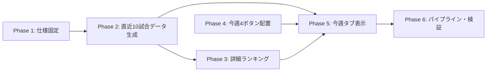

# トップページ「今週」タブ — 直近10試合・打撃ランキング Phase 計画書

**作成日**: 2026-09-05  
**状態**: 計画のみ。実装コード、生成データ、既存 UI は変更しない。  
**対象**: 2026 年のトップページ「今週」タブ、セ・パ別の週間打撃・投手ランキング導線、直近10試合打撃ランキング

---

## 1. 目的

トップページの「今週」タブに、選手ごとの**直近出場10試合**を集計した打撃ランキングを追加する。

- 各リーグの主ランキングを **Top5** で表示する。
- 補助ランキングを **Top3** で表示する。
- 「今週」タブのメインタブ直下、現在は TOP タブで球団ページリンクを表示している位置に、既存の4種類の切替ボタンを表示する。
- 4ボタンは「セ野手」「セ投手」「パ野手」「パ投手」とし、選択に応じて既存の今週ランキングを表示する。
- 直近10試合ランキングは今週タブ内に追加するが、週間（暦週）ランキングの定義・URL・表示を置き換えない。

## 2. 用語と確定前提

| 用語 | 本計画での意味 |
|---|---|
| 今週ランキング | 火曜始まりの `weekKey` で集計する既存の週間ランキング |
| 直近10試合 | 各打者が出場した、試合日が新しい順の最大10試合を合算した成績。チームの直近10試合ではない |
| 対象試合 | 2026 年の一軍公式戦で、canonical と打者成績が確定している試合 |
| Top5 | 主指標ごとに5人を表示するランキング枠 |
| Top3 | 補助指標ごとに3人を表示するランキング枠 |

### 表示仕様の提案

初期リリースでは、直近10試合の表示を次の構成で固定する。

| 区分 | 指標 | 表示人数 | 意図 |
|---|---|---:|---|
| 主ランキング | 打率、OPS、本塁打 | 各 Top5 | 直近の打撃好調者を比較する中心枠 |
| 補助ランキング | 安打、打点、盗塁 | 各 Top3 | カウント系の見どころをコンパクトに補う |

率系の直近10試合ランキングには最低打席条件を設ける。初期値は **10打席以上** とし、データが不足する場合は「対象者なし」と表示する。カウント系には規定を設けない。

> 実装開始前の最終確認事項: 「Top5,3」が上表のように主指標 Top5・補助指標 Top3 を意味するか。異なる場合は、指標セットまたは人数だけを Phase 1 で変更し、集計・UI の土台は共通化する。

## 3. 画面構成

```text
メインタブ
  TOP / 今週 / 予想投手 / ニュース / 順位表

今週を選択したとき
  セ野手 | セ投手 | パ野手 | パ投手     ← TOP タブの球団リンク位置へ移設
  選択中リーグ・区分の既存「今週」ランキング
  直近10試合 打撃ランキング                 ← 野手選択時のみ表示
    主ランキング: 打率 / OPS / 本塁打（各 Top5）
    補助ランキング: 安打 / 打点 / 盗塁（各 Top3）
```

- デスクトップとモバイルで同じ4ボタンをメインタブ直下に出す。
- モバイル下部の `RankingBottomNav` は、重複導線を避けるため削除または今週タブでは非表示にする。
- 投手選択時は直近10試合**打撃**ランキングを表示しない。投手の既存今週ランキングのみを表示する。
- 「セ野手」「パ野手」では、既存の週間打撃ランキングの下に同リーグの直近10試合打撃ランキングを表示する。
- 指標名・「成績一覧」・選手名は、それぞれ詳細ランキングまたは選手ページへ遷移できるようにする。

## Phase 1 — 要件固定とデータ定義

**目的**: 集計単位、対象試合、指標、同率、欠損時の扱いを実装可能な仕様に固定する。

**決めること**

1. 「直近10試合」を選手単位の出場10試合とする。代打での出場も1試合として数える。
2. 試合日の降順、同日複数試合は canonical の開始時刻または安定した game ID 順で並べる。
3. 選手が10試合に満たない場合は、出場済みの全試合で集計する。ただし率系は最低10打席を満たす場合だけランキング対象とする。
4. チーム移籍・リーグ移籍が起きた場合は、最新の試合時点の所属リーグで表示し、集計は対象10試合を維持する。
5. 同値は既存ランキングのソート規則（主値、打席数、安打数、選手 ID）に合わせ、順位表示は `1, 2, 2, 4` の競技順位にするか連番にするかを明記する。
6. 未確定・中止・成績欠損の試合は除外し、10試合に届くまで過去へ遡る。

**成果物**

- `docs/plan_top_recent_10_games_batting_rankings_phases.md` の仕様確定版
- 入出力 JSON のスキーマ
- 指標ごとの対象条件・ソート・同率処理の表

**受け入れ条件**

- 任意の選手1人について、採用した10試合と合算値を試合別成績から再計算できる。
- 「直近10試合」と「今週」の期間・集計対象が混同されない。

## Phase 2 — 直近10試合の派生データを生成

**目的**: 既存 canonical と選手別試合成績を再利用し、外部 HTTP 取得を増やさずに選手別直近10試合成績を生成する。

**実装候補**

| 役割 | 候補パス | 内容 |
|---|---|---|
| 集計ロジック | `lib/ranking/buildRecentGamesBattingRankings.ts` | 選手別の試合列を新しい順に並べ、最大10試合を合算 |
| ビルドスクリプト | `scripts/build_recent_10_games_batting_rankings.ts` | 年度・リーグごとの静的 JSON を生成 |
| 出力 | `public/data/rankings/recent-games/2026/{CL|PL}/batting.json` | ランキングページとトップ用スナップショットの入力 |
| 検証 | `scripts/validate_recent_10_games_batting_rankings.ts` | 対象試合数、合算、順位、欠損を検査 |

**JSON スキーマ案**

```json
{
  "schemaVersion": "recent-10-games-batting-v1",
  "year": "2026",
  "league": "CL",
  "asOf": "2026-09-05T12:00:00+09:00",
  "metrics": ["avg", "ops", "hr", "h", "rbi", "sb"],
  "rows": [
    {
      "playerId": "...",
      "name": "...",
      "team": "...",
      "gamesIncluded": 10,
      "firstGameDate": "2026-08-20",
      "lastGameDate": "2026-09-04",
      "pa": 42,
      "ab": 36,
      "h": 15,
      "hr": 3,
      "rbi": 11,
      "sb": 2,
      "avg": 0.417,
      "ops": 1.123
    }
  ]
}
```

**注意点**

- 既存の週別派生 JSON は暦週の合算であり、直近10試合の入力としてそのまま使わない。
- 1試合ごとの打撃成績を持つ既存派生データを正とし、canonical の試合完了判定と突き合わせる。
- 日次パイプラインのランキング再生成後にこの JSON も更新し、トップと詳細ページの鮮度を合わせる。

**受け入れ条件**

- CL・PL それぞれで、生成時点までに出場した全打者の行を出力する。
- 各行の `gamesIncluded` は 1〜10、`lastGameDate` は対象試合の最新日となる。
- 再実行しても同じ入力なら同じ順位・JSON になる。

## Phase 3 — 直近10試合打撃ランキングページ

**目的**: トップのカードから遷移でき、全件・全指標・集計対象を確認できる詳細ページを先に用意する。

**URL 案**

```text
/ranking/recent-games/2026/CL/batting?sort=ops&order=desc
/ranking/recent-games/2026/PL/batting?sort=avg&order=desc
```

**表示内容**

- 見出し: `直近10試合 打撃ランキング`、リーグ名、更新日時。
- 注記: `各選手の直近出場10試合を集計。10試合未満は出場済み全試合。率系は10打席以上。`
- 指標切替、順位、選手、球団、対象試合数、対象期間、打席、打数、安打、本塁打、打点、盗塁、打率、OPS。
- 各選手名から既存の選手ページへ遷移する。
- 空データ・生成失敗時は、通常のランキングと区別できるエラー文を表示する。

**受け入れ条件**

- URL の `sort` / `order` を変えると表示順と順位が正しく変わる。
- トップで表示する Top5 / Top3 と詳細ページの先頭行が一致する。
- 画面幅 360px とデスクトップ幅で列の欠落・横はみ出しがない。

## Phase 4 — 今週タブの4リンクボタンを指定位置へ配置

**目的**: 既存の「セ野手・セ投手・パ野手・パ投手」切替を、TOP タブの球団ページリンクと同じ位置へ移し、今週タブの主導線にする。

**対象コード**

- `app/components/top/TopPageClient.tsx`
- `app/components/common/RankingBottomNav.tsx`
- 必要に応じて、今週専用の `TopPageWeeklyCategoryNav` コンポーネントを新設

**作業**

1. `TOP_TEAM_PAGE_NAV_ROWS` と同じメインタブ直下の領域に、今週タブ専用の4ボタンを追加する。
2. 選択状態は `topWeeklyView` と単一の state で管理し、既存の `TopPageWeeklyTabContent` の切替に接続する。
3. 表示ラベルは既存の `セ野手 / セ投手 / パ野手 / パ投手` を維持する。
4. ボタンのアクティブ状態、キーボード操作、`aria-current` を設定する。
5. モバイル下部の同じ4切替は今週タブでは表示しない。TOP タブ・順位表への影響は出さない。

**受け入れ条件**

- 今週タブを開いた直後に4ボタンがメインタブ直下に見える。
- 4ボタンでリーグ・野手投手を切り替えたとき、既存週間コンテンツが正しく入れ替わる。
- TOP タブの球団リンク表示、TOP タブ下部ナビ、順位表下部ナビは従来どおり動く。

## Phase 5 — 今週タブに直近10試合ランキングを組み込む

**目的**: 週間打撃ランキングを維持したまま、野手表示の下へ直近10試合ランキングを表示する。

**対象コード**

- `app/components/top/TopPageWeeklyTabContent.tsx`
- `app/components/TopPageLeadersClient.tsx`
- 新規候補: `app/components/top/TopPageRecentGamesBattingRankings.tsx`
- 新規候補: `lib/topPage/fetchRecentGamesBattingRankingsClient.ts`

**作業**

1. `TopPageWeeklyTabContent` で、野手ビュー時だけ直近10試合データを読み込む。
2. 初期表示に必要な CL / PL の直近10試合データはサーバー先読みを検討し、現在の週間 `initialPayload` と同じ方針で二重取得を避ける。
3. 主指標3枠は各 Top5、補助指標3枠は各 Top3 として、既存トップリーダーの行コンポーネントを再利用する。
4. 指標名クリックは Phase 3 の詳細ランキングを該当 `sort` 付きで開く。「成績一覧」は OPS 降順の詳細ランキングへ遷移する。
5. 直近10試合のタイトル、対象期間、更新日時、最低打席条件をカード上部に表示する。
6. データが無いリーグだけは週間ランキングを残し、直近10試合枠に限定した空状態を出す。

**受け入れ条件**

- セ野手・パ野手で Top5 と Top3 が表示され、セ投手・パ投手には表示されない。
- カードの順位、選手、数値、対象試合数が Phase 3 の詳細ランキングと一致する。
- 指標リンク・成績一覧・選手リンクがすべて有効である。

## Phase 6 — パイプライン、テスト、運用

**目的**: 日々の更新で直近10試合ランキングが自動更新され、データ不整合を検出できるようにする。

**作業**

1. `daily:npb-pipeline` または既存 `rankings:rebuild` の、個人試合成績更新後・トップ用スナップショット生成前に Phase 2 のビルドを追加する。
2. 直近10試合ランキング JSON の生成有無、更新日時、CL/PL、必須指標、Top5/Top3 件数を自動検証する。
3. 固定サンプル選手について、手作業で選んだ10試合の合計と JSON を比較する回帰テストを追加する。
4. UI テストで、今週タブの4ボタン位置、切替、野手時のみの直近10試合表示、詳細遷移を確認する。
5. 生成失敗時に古い JSON を誤って「最新」と表示しないよう、`asOf` の監視または鮮度警告を追加する。

**受け入れ条件**

- 日次更新の1回の実行で、週間ランキングと直近10試合ランキングがともに更新される。
- 入力データがない場合、失敗箇所と復旧コマンドがログから分かる。
- 本番相当のモバイル・デスクトップで、今週タブの表示と遷移を確認できる。

## 4. 依存関係



## 5. リスクと判断基準

| リスク | 対応 |
|---|---|
| 「直近10試合」をチーム単位と選手単位で混同する | Phase 1 で選手の直近出場10試合と明文化し、詳細ページに対象期間・試合数を表示する |
| 10試合未満の少数打席選手が率系上位を占める | 率系に最低10打席条件を設け、対象条件を常に表示する |
| 週間ランキングのデータ経路を流用して期間が誤る | 週別 JSON とは別に、試合単位データから直近10試合を生成する |
| モバイルで4切替が二重に見える | Phase 4 で今週タブの `RankingBottomNav` を非表示にし、移設した上部ボタンを唯一の切替にする |
| 日次更新の順序が不正で古いランキングが残る | Phase 6 で派生データ更新後、トップ用表示前の順序を固定し、`asOf` を検証する |

## 6. 実装しない範囲

- 投手の直近10試合ランキング。
- 2025 年以前への展開。
- チーム単位の直近10試合ランキング。
- 今週ランキングの期間定義、既存週間 URL、既存の規定打席・規定投球回ルールの変更。

