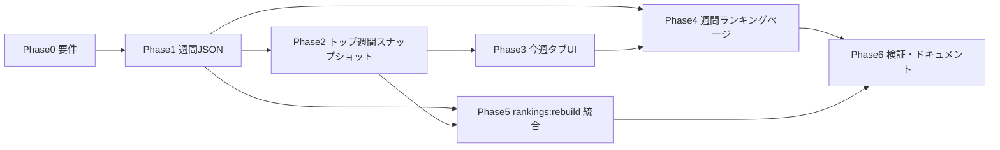

# トップページ「今週」タブ・週間ランキング — Phase 計画書

> **Phase 0**: ✅ 完了 — 要件確定書 [`plan_top_weekly_phase0_spec.md`](plan_top_weekly_phase0_spec.md)

## ゴール

1. トップページの **「今週」タブ**で、**「TOP」タブと同様**に指標名（OPS・打率など）と上位選手・数値を表示する。
2. 指標名クリック・「成績一覧」など、**TOP と同じきっかけ**で **週間ランキングページ**へ遷移できるようにする。
3. 今後の **一括取得・派生ビルド**（`phase3:derived:2026` → `rankings:rebuild` 等）のたびに、**週間ランキング用 JSON とトップ用スナップショットも自動更新**される運用に載せる。

## 現状（2026-05 時点）

| 領域 | 状態 |
|------|------|
| TOP タブ | `TopPageLeadersClient` / `TopPagePitchingLeadersClient` が `public/data/top-leaders/{年}/{CL\|PL}/{batting\|pitching}.json` を読み、指標名は `Link` → `/ranking/{年}/{リーグ}?sort=...` |
| 今週タブ | `TopPageClient.tsx` で **「今週の成績（準備中）」** のみ |
| 週別打撃データ | Phase 17 → `_data/derived/player_season_batting_period/{年}/yahoo_*.json`（`split_type: calendar_week`、週境界は `lib/yahooGame/jstPeriodKeys.ts` と個人ページと同一） |
| 週別投球データ | Phase 7 → 投手期間派生（`calendar_week`） |
| 週間ランキング JSON | **未整備**（`public/data/rankings/` はシーズン通算のみ） |
| 週間ランキング UI | **未整備**（`/ranking/{年}/{league}` は通算専用） |
| 一括パイプライン | `npm run daily:npb-pipeline` の末尾で Phase12/19/28 → `top-leaders` → `top-weekly-leaders` を実行（`docs/data_operation_rules.md` § C） |

## 前提・定義（ブレ防止）

### 「今週」の週キー

- **定義**: 当日（JST 暦日）を含む **火曜始まり・日曜終わり** の週の、**火曜日の `YYYY-MM-DD`**（`tuesdayWeekKeyFromYmd`）。
- **表示ラベル**: Phase 17 と同じ `split_label`（例: `5/13〜5/18`）。
- **個人ページの週間成績**（`SeasonStatsPilot`）と **必ず同じ週境界**を使う（Phase 17 / Phase 7 の SSOT を流用。再定義しない）。

### 表示する指標（TOP タブとの対応）

| 区分 | 大きい枠（top3） | ミニ枠 | 参照 |
|------|------------------|--------|------|
| 打撃 | OPS・打率・本塁打 | 出塁率・長打率・打点・安打・盗塁 | `lib/ranking/leadersFromRankingsJson.ts` の `TOP3_METRICS` / `MINI_METRICS` |
| 投球 | Phase 19 / 投手トップリーダーと同セット | 同上方針 | `TopPagePitchingLeadersClient` → `LeadersPanel`（`statsCategory: pitching`） |

※ 週間は **規定打席・規定投球回の閾値を週用に別定義**する（Phase 1 で数値を決め、通算と混同しない）。

### URL 設計（Phase 0 で確定）

詳細は [`plan_top_weekly_phase0_spec.md` §6](plan_top_weekly_phase0_spec.md) を参照。

- 打撃: `/ranking/weekly/{year}/{weekKey}/{league}?sort=...&order=...`
- 投球: `/ranking/pitching/weekly/{year}/{weekKey}/{league}?sort=...&order=...`
- `weekKey`: 火曜 `YYYY-MM-DD`（`tuesdayWeekKeyFromYmd`）

---

## Phase 0 — 要件固定と受け入れ条件 ✅ 完了

**成果物**

- [`docs/plan_top_weekly_phase0_spec.md`](plan_top_weekly_phase0_spec.md)（週定義・SSOT・規定・指標・URL・パス一覧）
- `docs/DATA_PATHS.md` に週間パス草案を追記（下記「週間ランキング用パス」）

**確定サマリ**

| 項目 | 決定 |
|------|------|
| 対象週（トップ） | 常に「今週」のみ |
| 対象週（ランキング） | 今週デフォルト + 過去 3 週を JSON 保持 |
| 対象年度 | v1 は **2026** 先行 |
| データ | Phase 17 / 7 を**読むだけ**（再集計禁止） |
| 規定 | 打撃 `pa > 0` の週行のみ（通算の動的規定は使わない） |
| 欠損 | 空表示・ランキング 0 件でもページ表示 |

---

## Phase 1 — データ層: 週間ランキング JSON の一括生成 ✅ 完了

**目的**: シーズン通算の Phase 12/19 と同様、**静的 JSON を指標×リーグ×週で出力**し、ランキングページ・トップの両方の SSOT にする。

**実装**: `npm run phase28:build:weekly-rankings` → `lib/ranking/buildWeeklyRankingsFromPeriod.ts`

**入力**

- 打撃: Phase 17 済みの `player_season_batting_period/{year}/` から **`split_type === calendar_week"` かつ `split_value === weekKey`** の行を抽出（**再集計しない** — Phase 0 確定）
- 投球: Phase 7 の週間行（同上）
- リーグ振り分け: Phase 12 と同じ名簿・`leagueBucketForTeamShort`
- 指標リスト: `loadMetricsFromRecord()`（打撃）/ 投手 Record（投球）

**出力（案）**

```
public/data/rankings/weekly/{year}/{weekKey}/{CL|PL}/{metric}.json
public/data/rankings/weekly/{year}/current-week.json   # { weekKey, weekLabel } のみ（トップが「今週」を解決）
```

**スクリプト（新規）**

| npm 名（案） | 実体 |
|--------------|------|
| `phase28:build:weekly-rankings` | `scripts/phase28_build_weekly_rankings_from_period.ts --year 2026 [--week YYYY-MM-DD]` |
| 省略時 `--week` | 未指定なら **実行日の今週**（`tuesdayWeekKeyFromYmd`） |

**週の扱い**

- v1: ビルド時に **「今週」+ 直近 N 週**（例: 4 週）を生成し、過去週ランキングも URL で見られるようにする（ストレージは週×指標×2 リーグ分なので許容範囲）
- 古い週は上書きせず、同じ `weekKey` は再ビルドで更新

**依存**

- Phase 17（打撃）・Phase 7（投球）が先に完了していること
- Phase 11 相当の集計ロジックと矛盾しないこと（可能なら Phase 17 の行を **読むだけ** にして再集計を避ける）

---

## Phase 2 — トップ用「今週リーダー」スナップショット ✅ 完了

**目的**: 通算の `top-leaders:build:2026` と同様、**週間ランキング JSON から上位 N 件だけ切り出した軽量 JSON** を用意し、トップの表示を高速・安定にする。

**実装**: `npm run top-weekly-leaders:build:2026`（前提: `phase28:build:weekly-rankings`）→ `lib/topPage/weeklyLeadersSnapshotBuild.ts`

**出力（案）**

```
public/data/top-leaders/weekly/{year}/{weekKey}/{CL|PL}/batting.json
public/data/top-leaders/weekly/{year}/{weekKey}/{CL|PL}/pitching.json
```

**実装方針**

- `lib/ranking/leadersFromRankingsJson.ts` の `buildBattingLeadersConfigFromRankings` を **週間パス向けに一般化**（`rankingsRoot` / `weekKey` を引数化）
- 新規: `scripts/build_top_weekly_leaders_snapshot.ts` または `build_top_leaders_snapshot_2026.ts` の拡張

**スクリプト（案）**

```
npm run top-weekly-leaders:build:2026
```

---

## Phase 3 — フロント: 「今週」タブ UI（TOP タブの parity） ✅ 完了

**目的**: `TopPageClient` の placeholder を、TOP と同構造のリーダー UI に差し替える。

**実装**: `TopPageWeeklyTabContent` + `TopPageLeadersClient` / `TopPagePitchingLeadersClient` の `weekKey` 対応、`lib/topPage/weeklyRankingUrl.ts`

**変更ファイル（想定）**

| ファイル | 内容 |
|----------|------|
| `app/components/top/TopPageClient.tsx` | `activeMainTab === 1` で週間リーダーを描画 |
| `app/components/TopPageWeeklyLeadersClient.tsx`（新規） | `TopPageLeadersClient` をベースに週間 URL・fetch に差し替え |
| `app/components/TopPageWeeklyPitchingLeadersClient.tsx`（新規） | 投手版 |
| `lib/topPage/fetchTopWeeklyLeadersClient.ts`（新規） | `current-week.json` → 該当 `top-leaders/weekly/...` を fetch |
| `lib/topPage/weeklyRankingUrl.ts`（新規） | `getWeeklyRankingUrl(year, league, weekKey, metric)` / `getWeeklyStatsListUrl(...)` |

**UI 要件（TOP と揃える）**

- 指標名: 黄色ラベル・中央配置・`Link` で週間ランキングへ（`getRankingUrl` の週間版）
- 「成績一覧」: 週間ランキングのデフォルト指標（例: OPS / 防御率）へ `router.push`
- 選手行: 既存 `LeaderRow` / `MiniLeaderRow` を **共通化して再利用**（個人ページリンクは通算と同じ）
- レイアウト: `usesTopBattingModernLayout` / 4 グリッドは **2026 打撃と同じ条件**で週間にも適用

**週ラベル表示**

- セクション見出しに `今週（5/13〜5/18）` を `current-week.json` またはスナップショットの meta から表示

---

## Phase 4 — 週間ランキングページ

**目的**: TOP から飛ぶ先の **週間版ランキング UI** を用意する。通算ページの UX を最大限流用する。

**ルート（案）**

```
app/ranking/weekly/[year]/[weekKey]/[league]/page.tsx
app/ranking/weekly/[year]/[weekKey]/[league]/WeeklyRankingPageClient.tsx
```

**データ読み込み**

- `public/data/rankings/weekly/{year}/{weekKey}/{league}/{metric}.json`
- 既存 `RankingUI` + `lib/ranking/adapter.ts` を拡張し、`rankingPathBase` を `/ranking/weekly` に、`season` 表示に週ラベルを付与（例: 「パ・リーグ OPSランキング（2026年・5/13〜5/18）」）

**週の切替（ランキングページのみ）**

- 週セレクト: `current-week.json` と、ディスク上に存在する `weekKey` 一覧から生成
- 切替時は `?sort=` を維持して `router.push`

**投手**

- `/ranking/pitching/weekly/...` または打撃と同階層で `category=pitching`（Phase 2 のパス設計と同時に決定）

---

## Phase 5 — 一括パイプラインへの組み込み（重要） ✅ 完了

**目的**: ユーザ要求どおり、**今後の一括取得・派生ビルドのたびに週間ランキングも更新**されるようにする。

**実装**: `rankings:rebuild` に `phase28:build:weekly-rankings` と `top-weekly-leaders:build:2026` を追加。**日次**は `run_daily_npb_pipeline.mjs` 派生ブロック末尾でも同順実行（方針: `docs/data_operation_rules.md` § C）。

**現状の `rankings:rebuild`**

```text
phase12:build:rankings
→ phase19:build:pitching-rankings
→ top-leaders:build:2026
→ validate:canonical-batting-completeness
```

**拡張後（案）**

```text
rankings:rebuild
  ├─ phase12:build:rankings          # 通算（既存）
  ├─ phase19:build:pitching-rankings
  ├─ phase28:build:weekly-rankings   # 週間（新規）※ Phase 17/7 後
  ├─ top-leaders:build:2026
  ├─ top-weekly-leaders:build:2026   # 週間トップ（新規）
  └─ validate:...（任意で週間サンプル検証）
```

**`phase3:derived:2026:and-rankings` との関係**

- 変更なしで **`rankings:rebuild` の末尾に週間が乗る**形が望ましい（運用者は既存コマンド1本のまま）
- `rebuild:2026:page-data` = `phase3:derived:2026:and-rankings` でも週間が更新される

**canonical だけ増えて Phase 17 を回していない場合**

- 週間 JSON は古いままになる → `docs/DATA_PATHS.md` に  
  **「canonical 更新 → phase3:derived（Phase 17 含む）→ rankings:rebuild」**  
  を明記（`plan_unified_ranking_personal_stats_phases.md` Phase 5 と同趣旨）

---

## Phase 6 — 検証・ドキュメント

**目的**: 個人ページ週間表とランキング・トップの数値が一致することを自動で担保する。

**検証（案）**

| コマンド（案） | 内容 |
|----------------|------|
| `validate:weekly-ranking-vs-phase17` | ランダム/代表選手で Phase 17 の `calendar_week` 行と週間 JSON の OPS・打率等を突合 |
| 手動 | 今週タブ指標名クリック → 週間ランキングで同順位・同値 |

**ドキュメント更新**

- `docs/DATA_PATHS.md`: 週間 JSON / top-weekly-leaders のパス
- `docs/RANKING_PAGE_INFO.md`: 週間 URL の節を追加
- `README.md`: 一括更新手順に週間が含まれる旨を1行

---

## 実装順序（推奨）



| 順 | Phase | ユーザーに見える成果 |
|----|-------|----------------------|
| 1 | 0 | 仕様確定 |
| 2 | 1 | 週間ランキング JSON が disk にできる |
| 3 | 2 + 4（並行可） | 週間ランキングページが開ける |
| 4 | 3 | 今週タブに指標名・数値・リンク |
| 5 | 5 | 一括ビルドで週間も更新 |
| 6 | 6 | 回帰テスト・運用文書 |

---

## リスク・注意点

1. **再集計 vs Phase 17 読み取り**: Phase 28 で canonical を再集計すると Phase 17 とズレる可能性がある → **Phase 17 行を正としてランキング JSON を組み立てる**方が安全。
2. **週途中の更新**: 火曜〜日曜の途中では「今週」が日々変わるのではなく、**同一 weekKey 内で JSON だけ上書き**される。トップはビルド後のスナップショットを見る。
3. **規定打席**: 通算の `dynamicQualifyingPA` を週間に流用すると上位が空になりやすい → 週間専用ルールを Phase 0 で固定。
4. **年度 ≠ 2026**: v1 は 2026 先行。他年度は Phase 17/7 のデータがある年から横展開。

---

## スコープ外（別 Issue）

- 今週タブでの **過去週セレクタ**（ランキングページのみ v1 で対応可）
- 月間タブ・月間ランキング（Phase 17 の `calendar_month` は将来同型で Phase 29 等として追加可能）
- 予想投手・Quiz タブ

---

## 関連ファイル（実装時の参照）

| 用途 | パス |
|------|------|
| 今週 placeholder | `app/components/top/TopPageClient.tsx` |
| TOP 打撃リーダー | `app/components/TopPageLeadersClient.tsx` |
| TOP 投球 | `app/components/TopPagePitchingLeadersClient.tsx` |
| 通算ランキング URL | `getRankingUrl` in `TopPageLeadersClient.tsx` |
| トップ fetch | `lib/topPage/fetchTopLeadersClient.ts` |
| 週別派生（打撃） | `scripts/phase17_build_period_splits_from_canonical.ts` |
| 週境界 | `lib/yahooGame/jstPeriodKeys.ts` |
| 通算ランキング build | `scripts/phase12_build_rankings_from_phase11.ts` |
| トップスナップショット build | `scripts/build_top_leaders_snapshot_2026.ts` |
| 一括 rebuild | `package.json` → `rankings:rebuild`, `phase3:derived:2026:and-rankings` |

---

## まとめ

- **今週タブ**は TOP タブの UI・リンクパターンを踏襲し、データは **Phase 17/7 の週次行**と **週間ランキング JSON** を SSOT にする。
- **週間ランキングページ**は通算 `/ranking/{year}/{league}` の週版として新設する。
- **一括更新**は `rankings:rebuild`（および `phase3:derived:2026:and-rankings`）に **Phase 28（週間 JSON）+ 週間 top-leaders build** を追加し、運用コマンドを増やさない。
