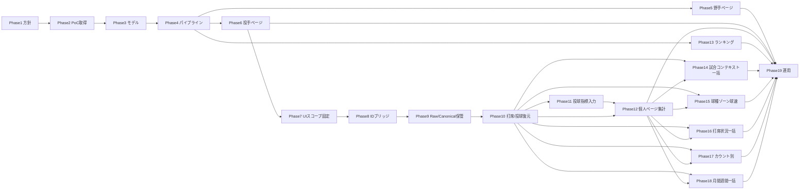

# Yahoo!スポーツナビ試合ページ連携 計画書

## 目的

[広島 vs 中日 一球速報（2021038624）](https://baseball.yahoo.co.jp/npb/game/2021038624/score) のような **試合URL** を起点に、次の3種類のサイトページを更新可能にする。

| 対象 | 想定する更新内容の例 |
|------|----------------------|
| **野手個人ページ** | 今季打撃成績（1試合分の加算・または試合ログ由来の表示） |
| **投手個人ページ** | 今季投球成績・球種/ゾーン等（データ取得パイプライン拡張） |
| **打撃ランキングページ** | `public/data/rankings/...` 等の集計ソースへの反映、またはランキング用JSONの再生成 |

データソースとして試合ページ内の次を想定する。

- **一球速報** … 全球のコース・球速など（詳細投球）
- **テキスト速報** … イニング進行・結果のテキスト
- **出場成績** … 打席・投球結果の要約

### 2026年ランキングページへの組み込み（方針・確定）

試合取り込み・マスタ反映・集計パイプラインで **計算し終わった打撃ランキング相当のデータ** は、最終的に **年度 `2026` のランキングページ**（例: `/ranking/2026/CL`・`/ranking/2026/PL`）の **既定表示**として組み込む。ユーザーが `yahooPoc` 等のクエリを付けなくても、通常の `loadRankingJson` 経路で読める状態を目指す。

| 項目 | 内容 |
|------|------|
| **データの載せ方（本番想定）** | `public/data/rankings/2026/CL/` および `.../PL/` 以下の指標 JSON を、`scripts/build_rankings_from_calculated.py` 等の **既存または拡張した再生成バッチ**で更新する。取り込んだ試合イベント（canonical 等）をマスタ CSV 集計にマージしたうえで再生成する。 |
| **`jsonLoader` の整合** | `lib/ranking/jsonLoader.ts` の **`dataYear`（2026 を 2025 に流用する分岐）** を見直し、**2026 年ページは 2026 用パスを参照**する。移行期間のみ流用を許す場合は、その条件と撤廃を本ドキュメントまたは `docs/` 1 ファイルに明記する。 |
| **PoC との境界** | Phase 4 の `?yahooPoc=1` および `GET /api/rankings-yahoo-poc` は **検証・デバッグ用**。本番の「計算結果の組み込み」の正は **上記静的 JSON ＋ `loadRankingJson`** とする。 |
| **完了フェーズ** | パイプライン接続の設計は Phase 4、**実際の組み込みと E2E 完了**は **Phase 13**（下記）。 |

---

## テスト対象試合（Phase 0）

| 項目 | 値 |
|------|-----|
| URL | `https://baseball.yahoo.co.jp/npb/game/2021038624/score` |
| game_id（想定） | `2021038624` |
| 確認観点 | スクレイピングで **1試合分** を正規化JSONに落とし、上記3ページが **期待どおり反応するか**（表示・API・ビルド）を検証 |

---

## Phase 1 — 方針・コンプライアンス・アーキテクチャ

### 概要

- データ取得方法（スクレイピング vs 公式API・提携データ）の確定
- サイト全体での **単一の真実のソース（SSOT）** を定義（例: `_data/` のマスタCSV、試合イベントJSON、APIレスポンス）

### 想定課題と解決策

| 課題 | 解決策 |
|------|--------|
| **利用規約・robots.txt** に抵触する可能性 | 法務・運用方針を文書化。可能なら **NPB公式・STATS API等の正規ソース** に寄せる。スクレイピングする場合は頻度・User-Agent・キャッシュ方針を明記し、過負荷を避ける。 |
| **HTML構造の変更** で壊れる | 取得層を **アダプタ** に閉じ、パーサをバージョン管理。スナップショットHTMLのフィクスチャで回帰テスト。 |
| **CSRで描画** されテキストが取れない | Playwright/Puppeteer 等の **ヘッドレス** を検討するか、XHR/APIエンドポイントの特定（ネットワークタブ調査）で **JSON直取得** に切り替え。 |

### Phase 1 で決めるべきこと（後工程前提・本計画での採用）

以下は **Phase 2 以降の設計・実装の前提** として Phase 1 内で確定させる（文書1枚・チェックリストでよい）。ここを空欄のまま進めると Phase 3〜4 で手戻りしやすい。

| # | 決定領域 | 本計画での採用（決定内容） | 後工程への効き |
|---|----------|---------------------------|----------------|
| 1 | **運用スコープ** | **段階A**: 手動実行・低頻度・PoC（1試合〜少数試合）。本番の無人クロール・商用スケールは **段階B** として Phase 1 を再開してから。 | Phase 19 のレート制限・監視の必須度が変わる。 |
| 2 | **SSOT（正のデータ）** | **イベント層**を正とする: 正規化済み **試合JSON**（打席・投球イベント、可能なら一球ログ）。**シーズン打撃/投球サマリ・ランキングJSON・マスタCSVの派生行** はすべて「イベントから再計算可能な生成物」。 | Phase 3 の永続化・Phase 4 の upsert 方針がブレない。 |
| 3 | **選手キー** | サイト内の **`npb_player_id`（名簿 `_data/npb_roster_2026.csv` 等と同一）** を主キー。Yahoo の `/npb/player/xxxx/` は **外部ID** としてマップテーブル（例: `_data/yahoo_player_id_map.csv`）に落とす。氏名フォールバックは **正規化ルールを1つに固定**（既存 `compactPlayerName` 等）。 | Phase 2 のマージ、Phase 5〜7 のページ/API のキーが一意になる。 |
| 4 | **試合キー・シーズンキー** | **試合ID** = URL の数値部（例: `2021038624`）。パイプラインのパーティションは **`{seasonYear, leagueOrCompetition}`**（例: `2026` + `CL`）。リーグ判定は Phase 2 PoC 時点で **固定ルール**（対戦カードからのマスタ参照など）を文書化。 | Phase 3 の冪等マージ、Phase 4 の `public/data/rankings/{year}/{league}/` との整合。 |
| 5 | **取得方式の優先順位** | **①** ページ内 XHR / 埋め込みJSON の特定と利用 → **②** 静的HTMLパース → **③** ヘッドレス。**Yahoo 固有のDOM依存は単一アダプタ**（例: `lib/scraping/yahooGameAdapter.ts`）に閉じ、Next のページ本体は **生成済みJSON・自APIのみ** 参照を原則とする。 | Phase 2 の実装場所、テストのフィクスチャ戦略、本番の依存が明確になる。 |
| 6 | **ソース間の優先（矛盾時・レイヤ別）** | **(A) 打席ごとの成績上の結果**（公式表に近い文言・ランキング／通算の土台）… **出場成績（`battingLines`／出場成績テーブルの打席結果セル）を第一とする**。一球ログは **検算・補完・欠損時の補助**であり、**一球だけを正として出場成績を上書きしない**（`docs/yahoo_plate_appearance_batting_rules.md` §6c、`docs/plan_batting_derived_appearance_stats_primary_phases.md` と整合）。**(B) 球ごとの物理ログ**（球種・球速・コース等）… **一球速報を材料とする**（出場成績には当該粒度が無いため「どちらが正」ではなく別レイヤー）。**(C) イニング得点・試合全体** … スコアボード／出場成績サマリを優先し、テキスト速報は補助。いずれのレイヤでも食い違いは **ログ＋フラグ**（黙って上書きしない）。 | Phase 2 の正規化、Phase 3 の検証ロジックの実装方針が決まる。 |
| 7 | **取り込みの冪等ルール** | 同一 `game_id` は **上書き（replace）または checksum 一致時スキップ** のどちらかを Phase 1 末までに1行で決める。推奨: **checksum 付き upsert**（中身が変わったら差し替え）。 | Phase 3 の二重加算防止が設計に落ちる。 |
| 8 | **ランキング・年度の扱い** | 取り込みデータは **実年度・実リーグ** でイベントを保存。**2026 年ランキングページへの組み込み**は本文「2026年ランキングページへの組み込み（方針・確定）」を正とする。イベント年度 → 公開 JSON パス（`public/data/rankings/2026/...`）と `jsonLoader` の対応は **Phase 4 で対応表を 1 枚にし、Phase 13 で実装・E2E 完了**とする。 | PoC（`yahooPoc`）と本番表示の経路が食い違わない。 |
| 9 | **成果物の置き場** | 正規化試合JSON: `_data/scraped_games/{game_id}.normalized.json`（例）。マッピング・取り込みログ: `_data/` 配下を原則。**巨大生HTML** はリポジトリにコミットしない（ローカルまたはCIアーティファクト）。 | Phase 2 のパス固定、リポジトリ肥大の防止。 |
| 10 | **コンプライアンスの最小ライン** | 少なくとも **robots.txt の確認**、**取得間隔の下限**（手動PoCは問題化しにくい）、**User-Agent に連絡可能な識別子** を Phase 2 コードに入れる。本格的自動化は **別途利用規約の確認** を Phase 1 チェックリストに明記。 | Phase 19 以前に「やってはいけないこと」が明文化される。 |

**Phase 1 の完了定義（提案）:** 上表の 1〜10 が README または `docs/yahoo_integration_phase1_decisions.md` など **1ファイルに書かれていること**（法務判断が必要な項は「未確定・PoCのみ」と明記でよい）。

---

## Phase 2 — 1試合スクレイピング PoC（テスト用）

### 概要

- 指定URLの **1試合だけ** を取得し、正規化した **試合JSONスキーマ**（v0）を出力
- 一球速報・テキスト速報・出場成績から取れる範囲を列挙し、欠損フィールドを明示

### 想定課題と解決策

| 課題 | 解決策 |
|------|--------|
| ページが **複数タブ**（一球/テキスト/出場成績）でURLが分岐 | `game_id` をキーに各タブURLを組み立てるルールを定義し、同一 `game_id` で結合。 |
| **選手IDの揺れ**（Yahooの `npb/player/xxxx/top` と自サイトの `npb_player_id`） | マッピングテーブル `_data/yahoo_player_id_map.csv`（またはAPI）を用意。名簿CSV（`npb_roster_2026.csv`）と **正規化氏名** でフォールバック照合。 |
| 盗塁・エラー・犠打など **テキスト速報の曖昧さ** | テキストは補助。**打席結果の正は出場成績**（Phase 1 表 #6 (A)）。可能なら一球ログと **突合** し、矛盾時はフラグ付きでログ。 |

### 成果物（実装済み）

- **取得＋正規化**: `python scripts/run_yahoo_phase2_poc.py --game-id 2021038624`  
  または `npm run scrape:yahoo:phase2`
- **出力**: `_data/scraped_games/{game_id}.normalized.json`、生HTMLは `_data/scraped_games/raw/`（`.gitignore` 対象）

---

## Phase 3 — ドメインモデルと永続化

### 概要

- **PitchEvent**（球速・コース・球種） / **PlateAppearance** / **PitchingLine** / **BattingLine** などの型定義
- 1試合・1シーズンでの **冪等なマージ**（同じ試合を二重取り込まない）

### 想定課題と解決策

| 課題 | 解決策 |
|------|--------|
| 再実行で **二重加算** | `game_id` 単位で upsert。取り込みログ（checksum / updated_at）。 |
| データ量増大 | 試合単位ファイル分割 + シーズンサマリの **派生テーブル**（ビルド時集計）。 |

### 成果物（実装済み）

| 項目 | 場所 |
|------|------|
| ドメイン型・canonical ビルド | `lib/yahooGame/types.ts`, `buildCanonical.ts`, `normalizedV0.ts`（Zod） |
| 冪等 ingest | `lib/yahooGame/persistCanonical.ts`（`sourceCompositeFingerprint` 一致時はスキップ） |
| CLI | `npm run ingest:yahoo:canonical` または `npx tsx scripts/ingest_yahoo_canonical.ts --game-id 2021038624` |
| 出力 | `_data/scraped_games/canonical/{game_id}.json`、`ingest_manifest.json` |

`domain.plateAppearances` / `pitchEvents` は Phase 4（一球取り込み）まで空配列。`battingLines` / `pitchingLines` は出場成績行からの **ヒューリスティック抽出**（後続で精密化可）。

---

## Phase 4 — パイプライン（マスタCSV / ランキングJSON との接続）

### 概要

- 既存の `batting_*_from_master.csv` や `public/data/rankings/` 生成フローを調査し、**どこに差し込むか** を決める
- 1試合取り込み → **差分だけ** 既存集計に反映する経路を設計

### 想定課題と解決策

| 課題 | 解決策 |
|------|--------|
| ランキングが **JSON前提**（`loadRankingJson`） | 試合取り込み後に **ランキングJSON再生成スクリプト** を実行するバッチに組み込む。または開発中は「オーバーレイJSON」を別パスで読むFeature Flag。 |
| 2026年が **2025データ流用** の分岐がある | `jsonLoader.ts` の `dataYear` ルールと整合。2026専用ディレクトリ or 明示的なシーズンキーを計画に含める。 |

### 成果物（実装済み）

| 項目 | 内容 |
|------|------|
| マスタ橋渡しCSV | `npm run pipeline:yahoo:phase4` → `_data/scraped_games/derived/{game_id}_batting_master_bridge.csv`（自動マージはしない） |
| manifest | `_data/scraped_games/derived/{game_id}_phase4_manifest.json` |
| PoC API | `GET /api/rankings-yahoo-poc?season=2026&league=CL&metric=打率&gameId=2021038624` … canonical + `npb_roster_2026.csv` 照合 |
| ランキングUI（PoC） | `/ranking/2026/CL?sort=avg&yahooPoc=1`（`yahooGameId` で試合切替可）を **検証用**とする。計画どおり API から 1 試合分を表示する場合はクライアントから `/api/rankings-yahoo-poc` を読む実装とする。規定打席フィルタは **スキップ**。**通常の 2026 ページへの組み込み**は本文「2026年ランキングページへの組み込み」および **Phase 13** を正とする。 |
| 本番フル再生成 | 従来どおり `scripts/build_rankings_from_calculated.py` 等（2025年以降の制約は各スクリプト参照）。**2026 ディレクトリへの出力と Yahoo 取り込み後の再実行**は Phase 13 で本計画の組み込み方針に沿って拡張する。 |

`public/data/rankings/*.json` の **一括再生成（2026 本番組み込みを含む）は Phase 4 では行わない**（本番用パイプラインと分離し、**完了は Phase 13**）。

---

## Phase 5 — 野手個人ページ

### 概要

- 名簿照合済み選手に、**今季（または特定試合）** の打撃指標を表示
- 既存の `SeasonStatsPilot` / 菊池パイロットと **表示条件** を整理（名簿ありのみ等）

### 想定課題と解決策

| 課題 | 解決策 |
|------|--------|
| **1試合だけ** ではランキングに載らない・見た目が薄い | 「直近試合サマリ」ブロックを別枠で表示。またはテスト時は **デバッグバナー** でデータソースを明示。 |
| APIの形がページに直書き | `/api/players/[id]/season-stats` 等に **試合マージ後のJSON** を返す層を追加。 |

### 成果物（実装済み）

| 項目 | 内容 |
|------|------|
| 照合ロジック | `lib/yahooGame/battingLineForNpbPlayer.ts` … canonical の `battingLines` と名簿で `npb_player_id` 一致を解決 |
| API | `GET /api/players/[playerId]/yahoo-canonical-batting?gameId=2021038624` … パスは数値 ID または日本語名（個人ページ URL と同様）。`matched: false` 時は本文のみ（404 にしない） |
| UI | **現行UIのみ**（新規カード/ブロックは追加しない）。本APIは **検証用**として保持し、必要な場合のみ既存UIの裏側で参照する。 |

**前提:** `_data/scraped_games/canonical/{gameId}.json`（`npm run ingest:yahoo:canonical`）と `_data/npb_roster_2026.csv` がローカルに存在すること。

---

## Phase 6 — 投手個人ページ

### 概要

- 一球速報由来の **球種構成・ゾーン** を、既存の `/api/games/.../pitch-types` パターンに揃えるか拡張
- 「菅野シェル」UI（`showPitcherSeasonSuganoUi`）へ **props / fetch** でデータ注入（将来拡張と整合）

### 想定課題と解決策

| 課題 | 解決策 |
|------|--------|
| 現在は **特定gameId/pitcherId** にハードコード気味 | `game_id` + `pitcher_npb_id` で汎用ルート化。静的JSONを `public/data/games/{gameId}/...` に置く段階的移行。 |
| 複数試合の集約 | シーズン単位でイベントをrollupする **バックエンド集計** をPhase 3–4と一体設計。 |

---

## Phase 7 — UIスコープ固定（現行UIのみ・新規UI追加しない）

### 概要

- 本計画で「掲載したいもの」は **現在UIに既に存在するもののみ**とする。
- 新規カード・新規タブ・「直近試合サマリ」などの **新しい見せ方（UI追加）**は、別計画に分離し本計画から除外する。

### ゴール（このPhaseの完了定義）

- 計画書内の「新UI追加」を示す記述が無い（または「対象外」と明記されている）。
- 既存UIの範囲で、データ取得・保存・集計（裏側）を整備する。

### 具体ルール

- **OK**: 既存UIのデータソース差し替え（例: 既存ランキングが読むJSONを新パイプライン生成物に置換）
- **OK**: 既存UIの不具合修正・表示条件整理（見た目を増やさない範囲）
- **NG**: 新しいカード/ブロック/タブの追加、既存UIに無い「試合サマリ表示」を新設

### 成果物（実装済み）

- Phase 5 の個人ページUI記述を「現行UIのみ」に合わせて整理（新規カード前提を削除）。
- Phase 10–12 で「既存UIを埋めるための計算」を追加しても、**UIの見せ方を増やさない**方針が崩れないように計画書へ明記。

### 実行（完了チェック）

- [x] 新しいカード/タブ/ブロックの追加を、本計画のスコープ外とした
- [x] 本計画の目的を「既存UIをデータで埋める」に固定した

---

## Phase 8 — 選手IDブリッジ（NPB ↔ Yahoo）と問い合わせID解決の運用設計

### 概要

- サイト内の「正」のIDは **`npb_player_id`** とし、Yahoo ID は **外部ID（取得用）** として扱う。
- 「今季成績」等で Yahoo ID が必要な場合は、**問い合わせID解決（resolver）→ 取得（fetch）** を2段に分離し、例外ハードコードを増やさない。

### ゴール（このPhaseの完了定義）

- 個人ページ・API が受け取る `playerId` は **原則 `npb_player_id`**（数値）で統一される。
- Yahoo 由来のデータが必要なエンドポイントは、内部で `npb_player_id` → `yahoo_batter_id` を解決し、**解決できない場合は未連携として正常系で返す**（404 ではなく placeholder / `matched:false`）。
- 「ファビアンだけ特別」等の **個別 if 文**を増やさず、ブリッジ表の更新で対象を増やせる。

### 想定課題と解決策

| 課題 | 解決策 |
|------|--------|
| 表記揺れ・移籍・新入団でマップが陳腐化する | ブリッジ表を **データとして単一管理**し、未解決一覧・重複検出・差分更新の手順を用意する（週1回の手動でも可）。 |
| 全選手をYahoo IDに寄せると障害影響が大きい | Yahoo ID は「必要な機能だけ」解決して使う。サイト内の主キーは NPB に固定し、Yahoo停止時もページ全体は成立させる。 |
| 解決できないときにUXが崩れる | APIは「未連携」の正常レスポンスを返し、UIは「データ未連携」表示にフォールバックする（最終更新時刻や理由が出せると尚良い）。 |

### 成果物（追加・更新するもの）

| 項目 | 内容 |
|------|------|
| ブリッジ表（SSOT） | `_data/yahoo_player_id_map.csv`（推奨）または `lib/yahooNpbBatterIdMap.ts` を **唯一のソース**にする。キーは `npb_player_id` を主とし、必要に応じて `display_name_keys`（正規化名）を持つ。 |
| 解決API / 関数 | `resolve(npb_player_id) -> yahoo_batter_id \| null` を **1箇所**に集約（個別ページ側での if ハードコードを禁止）。 |
| 検証スクリプト | `validate`（例: NPB→Yahoo の重複、Yahoo→NPB の多対一、名簿にいるのに未解決をレポート）を用意し、更新時に必ず回す。 |

---

## Phase 9 — データ保管（Raw 全保存 + Canonical SSOT）初心者向けルール

### 概要（まずこれだけ）

- 「あとで新指標を作りたいから全部残したい」はOK。ただし保存先を **2つの箱**に分ける。
  - **Raw（生データ）**: 取得した HTML / 埋め込み JSON / XHR 応答などを、できるだけ加工せず保存（将来の材料）。
  - **Canonical（整理済み）**: サイト表示・集計に使うために正規化した JSON（SSOT / 日常運用の正）。

### ゴール（このPhaseの完了定義）

- `game_id` ごとに Raw が残り、後から「同じ入力」を再利用して再計算できる。
- 日常運用は Canonical を参照し、Raw の肥大がサイトの表示・ビルドを遅くしない。
- Raw は **Git に入れない**（容量・差分地獄回避）。Canonical は Git 管理してよい。

### 保存場所（推奨ディレクトリ）

| 種類 | 置き場 | 目的 |
|------|--------|------|
| Raw（生データ） | `_data/scraped_games/raw/{game_id}/` | 将来の再パース、指標追加、取りこぼし救済 |
| Canonical（整理済み） | `_data/scraped_games/canonical/{game_id}.json` | UI/API/集計の安定運用（SSOT） |
| Manifest（メモ） | `_data/scraped_games/raw/{game_id}/manifest.json` | 何をいつ取ったか・再現性の担保 |

### Raw フォルダに入れるもの（例）

- `score.html`（スコアページHTML）
- `stats.html`（出場成績ページHTML）
- `pitch.html`（一球速報ページHTML）
- `embedded.json`（ページ内に埋め込まれていたJSON）
- `xhr_*.json`（XHR で取れた JSON があれば）

※ファイル名は「後から見て分かること」を優先し、統一する。

### Manifest に最低限書くこと（初心者向け最小セット）

- `fetchedAt`（取得日時）
- `sourceUrls`（取得元URL一覧）
- `files`（保存したファイル一覧: `name`, `kind`, `sizeBytes`）
- `fingerprint`（同一内容判定の印: 例 `sourceCompositeFingerprint`）
- `parserVersion`（どのパーサ/スキーマで作ったか: 例 `yahoo-game-canonical-v1`）

### 運用ルール（詰まないための3つ）

1. **Raw は Git に入れない**
   - `_data/scraped_games/raw/` は `.gitignore` 対象（または外部ストレージへ退避）
2. **Canonical は Git 管理してよい**
   - サイズが抑えやすく、差分レビューもしやすい
3. **同じ試合の取り込みは冪等にする**
   - fingerprint が同一なら Raw 保存をスキップ
   - fingerprint が変わったら差し替え（履歴が必要なら `raw/{game_id}/revisions/` を追加）

### 想定課題と解決策

| 課題 | 解決策 |
|------|--------|
| Raw が肥大化して運用が重い | 圧縮（gzip/zstd）、game_id 単位分割、fingerprint 一致で保存スキップ。 |
| 「どれが何のデータ？」となる | `manifest.json` を必須にし、保存物の一覧と取得元URLを残す。 |
| 取得できない/欠損がある | Canonical は欠損を許容（`matched:false` 等）。Raw は「取れた範囲」を残して次回再取得へ。 |

---

## Phase 10 — 打席・投球イベントの復元（試合単位：個人ページ集計の材料を作る）

### 概要

- 目的: 個人ページ（野手/投手）の全見出し・表を埋めるために必要な「打席・投球」粒度の材料を、**試合単位で復元**して canonical に格納する。
- 方針: Raw（Phase 9）に保存してあるソース（HTML/埋め込みJSON/XHR等）から、**PitchEvent / PlateAppearance** を構築し、`_data/scraped_games/canonical/{game_id}.json` を「復元済み版」として更新できるようにする（冪等）。

### ゴール（このPhaseの完了定義）

- `canonical.domain.plateAppearances` と `canonical.domain.pitchEvents` が、少なくとも「ゾーン別」「球種別」「カウント/状況別」集計に必要なフィールドを持って埋まっている。
- `game_id` ごとに復元処理を再実行しても、**同一入力（fingerprint一致）なら結果が同一**（冪等）。
- 欠損がある場合は `game.missingOrPartial` に理由が残り、集計側（Phase 12）が「—」で成立できる。

### 入力（SSOT）

- Raw: `_data/scraped_games/raw/{game_id}/`（HTML、埋め込みJSON、XHRレスポンス等）
- Canonical: `_data/scraped_games/canonical/{game_id}.json`（Phase 3 ingest の出力・更新対象）

### 出力（canonical の拡張）

- `canonical.domain.pitchEvents[]`: 球種・速度・ゾーン・打者/投手（Yahoo ID）・結果など
- `canonical.domain.plateAppearances[]`: 打席単位のメタ（イニング、表裏、打順、打者/投手、結果要約、紐づく pitchEvents）

### 想定課題と解決策

| 課題 | 解決策 |
|------|--------|
| HTML/XHR が変わる | Raw を保存し、パーサはアダプタに閉じる。`missingOrPartial` に理由を残す。 |
| 復元が不完全 | まず「ゾーン」「球種」「左右」「状況」「期間」集計に必要な最小フィールドから埋める。 |
| **投手/打者の取り違え**（DOM のリンク順依存など） | Yahoo の一球ページ（`/score?index=...`）では `table#gm_rslt` 付近の見出しが **「打者 \| 投手」**になり、選手リンクも **打者→投手の順**で現れる。パーサは「先頭リンク=打者、次=投手」を基本にし、可能なら列見出し（「打者」「投手」）で判定して順序依存を避ける。 |

### 再実行時の注意（派生の更新）

- Phase 10 は **canonical（試合単位SSOT）を更新**するだけで、ランキング等の派生ファイルは自動更新されない。
  - ランキング表示まで直す場合は、Phase 10 のあとに **Phase 11 → Phase 12 → Phase 13** を再実行する（投手指標入力 → 個人ページ集計 → ランキング）。
  - **試合コンテキスト別**（球場・対左右・チーム別・主客）は **Phase 14**（一括バッチ）。
  - **球種・ゾーン・球速帯（ストレート含む）**は **Phase 15**（一球 `pitchEvents` の一括走査）。
  - **打席別・状況別**は **Phase 16**（`plateAppearances` の順序と状況メタの一括）。
  - **カウント別**のみ Phase 10 に **B/S カウント**が無いと成立しないため **Phase 17 を単独**（他 Phase と切り離し可）。
  - **月間・週間**は **Phase 18**（試合日から月キー・週キーを同時算出する一括）。
  - 運用・ガードは **Phase 19**。

---

## Phase 11 — 投球高度指標のための入力データ（取得・計算・派生JSON）

### 概要

- **目的**: 投手個人ページの「投球指標」で **入力が無いと正当な数値が出せない項目**（GO/AO、LOB%、援護系、リーグ比較系など）について、**データソースを明示し、取得または試合ログからの集計**で埋める。
- **方針**: Phase 10 で復元した `plateAppearances` / `pitchEvents` を正とし、**一括で機械化できるもの**と **別スコープ・別バッチが必要なもの**を分ける。

### 一括で進められるもの（本リポジトリの実装例）

| 指標 | 入力 | 手順 |
|------|------|------|
| **GO/AO**（ゴロアウト対フライアウトの比） | 各打席の `resultSummaryJa`（＋最終球の `resultJa`） | テキストから **ゴロ / 飛 / ライナー** をヒューリスティック分類し、投手別に件数を集計。`scripts/phase_pitcher_poc1_build_from_canonical.ts` が `basic.battedBallOuts: { ground, air }` を出力し、UI は比 `ground/air` を表示。公式記録と完全一致しない場合あり。 |

### 一括が難しいもの（別サブタスクまたは後続 Phase）

| 指標 | 不足していたもの | 取得方針 |
|------|------------------|----------|
| **LOB%** | イニングごとの**出塁状況と得点**が要る | Phase 10 の打席シミュレーションで **残塁**を追跡できるよう拡張する、またはスコアボード細粒度の取り込み。 |
| **援護率・援護回・援護点** | 自チームの**得点**が要る | Phase 3 の `game.scoreboard` 等から **イニング得点**を正規化し、投手のマウンド上イニングと突合。 |
| **RSAA / RSWIN** | **リーグ平均** 等 | `_data/derived/` またはマスタに **リーグ係数** を置き、**別バッチ**で係数を読み込む（年次更新）。 |
| **救援時回数・救援時失点** | **先発/救援**の区分 | 出場成績またはスタメン／継投のメタを canonical に持たせる。 |
| **IPR / NHB% / PR / KD** | サイト定義の確定 | 公式の定義式を1行に固定してから実装（用語の対応表を本節に追記）。 |

### ゴール（完了定義）

- **GO/AO** について、PoC 投手 JSON に `battedBallOuts` が入り、個人ページで **「—」** ではなく比が表示される（データが無い打席は分類不能のまま）。
- **LOB / 援護 / リーグ比較** は、上表の取得ソースが揃うまで **「—」のまま**でよい（捏造しない）。

### 成果物（コード）

| 項目 | 場所 |
|------|------|
| 打球種別アウト分類 | `lib/yahooGame/pitcherGoAoFromResult.ts` |
| `battedBallOuts` 付与 | `scripts/phase_pitcher_poc1_build_from_canonical.ts` |
| UI の GO/AO 列 | `lib/pitcherSeasonPocUi.ts` の `pitcherPocMetricRow2` |

---

## Phase 12 — 個人ページ用の集計（野手/投手：現行UIの全見出し・表を埋める）

### 概要

- 目的: **投手・野手個人ページに存在する全ての見出し・表**が「—」ではなく数値で埋まるように、シーズン集計（計算済みJSON）を生成する。
- 方針: 入力は **復元済み canonical（Phase 10）**、**Phase 11 で投手指標用に付与した派生**（例: `battedBallOuts`）、および名簿（`npb_player_id`）を正とし、ページ閲覧時に重い計算をしないよう **バッチで縮約JSONを生成**する。
- UIは増やさず、既存UIが読むAPI/データソースを「計算済み」に切り替える（Phase 7 準拠）。

### ゴール（完了定義）

- **野手個人ページ（`SeasonStatsPilot`）**の見出し・表が全て埋まる:
  - 通算成績 / 打撃指標
  - 対左右別の対戦成績
  - 球種別の打撃成績 / 球速別の打撃成績
  - チーム別の対戦成績 / 球場別の対戦成績
  - 巡目別の打撃成績 / ホーム&ビジターの対戦成績
  - スタメン時守備位置別の打撃成績 / 打順別の打撃成績
  - カウント別の打撃成績 / 状況別の打撃成績
  - 月間成績 / 週間成績（火曜始まり日曜終わり）
- **投手個人ページ（菅野シェルUI）**の見出し・表が全て埋まる:
  - 基本成績（複数表）/ 投球指標（複数表）
  - 対チーム別 / 左右別
  - コース別（対右/対左：5×5、被OPS/被打率/被本）
  - 球種一覧（円グラフ＋表）
  - 状況別 / 球場別 / ホーム&ビジター別 / イニング別 / 捕手別 / デー&ナイター別
  - 月間別 / 週間別

### 入力

- `_data/scraped_games/canonical/{game_id}.json`（Phase 10 で pitchEvents/plateAppearances が入っていること）
- `_data/npb_roster_2026.csv`（サイト内主キー: `npb_player_id`）
- Phase 8（IDブリッジ）で npb ↔ yahoo の照合を安定化（必要時）

### 出力（推奨：現行UIを100%埋める“計算済みJSON”）

| 出力 | 置き場（例） | 主キー | 対応UI |
|------|-------------|--------|--------|
| 野手: シーズン集計（スプリット一式） | `_data/derived/player_season_batting/{year}/{npb_player_id}.json` | `npb_player_id` | `SeasonStatsPilot` 全ブロック |
| 野手: 球種/球速帯（打撃） | `_data/derived/player_season_batting_pitch/{year}/{npb_player_id}.json` | `npb_player_id` | `SeasonStatsPilot` の「球種別」「球速別」 |
| 野手: 打席（必要なら） | `_data/derived/player_pa/{year}/{npb_player_id}.json` | `npb_player_id` | `SeasonStatsPilot` の「打席別」「カウント別」「状況別」 |
| 投手: シーズン集計（基本/指標/各スプリット） | `_data/derived/player_season_pitching/{year}/{npb_player_id}/summary.json` | `npb_player_id` | 投手「基本成績」「投球指標」「対チーム/左右/状況/球場/期間」 |
| 投手: 球種（集計） | `_data/derived/player_season_pitching/{year}/{npb_player_id}/pitch_types.json` | `npb_player_id` | 投手「球種一覧」 |
| 投手: ゾーン（対右/対左） | `_data/derived/player_season_pitching/{year}/{npb_player_id}/zone_stats.json` | `npb_player_id` | 投手「コース別（5×5）」 |

### 計算方法（要点）

- **集計単位**: `npb_player_id` を正とし、試合ごとの `yahooPlayerId` とブリッジして加算
- **冪等**: `game_id` ごとの fingerprint を記録し、同一試合を二重加算しない
- **週間**: 火曜始まり日曜終わり（現行UIのルールに合わせる）
- **ゾーン**: 決着球（打席の最終 pitchEvent）をゾーン集計の対象にする（現行UIの説明文と整合）

---

## Phase 13 — 打撃ランキングページ

### 概要

- **2026年ランキングページへの組み込みを完了する:** パイプラインで計算・再生成した指標 JSON を `public/data/rankings/2026/{league}/`（または本計画で定めた同等パス）に配置し、`loadRankingJson('2026', league, …)` が **2025 流用なしで**（または移行ルールどおりに）それを取得する。
- **既定 URL での確認:** クエリなしの `/ranking/2026/CL`（および PL）で、取り込み・再生成後の並び・値が期待どおりであることを **E2E** で確認する。
- PoC 用 `yahooPoc` / `/api/rankings-yahoo-poc` は補助線とし、**本番の正は静的 JSON 経路**とする（本文「2026年ランキングページへの組み込み」参照）。

### 取得の方法

- **入力**: Phase 4/12 でマスタに合わせて計算した **指標値**（打率・本塁打・OPS 等）を、リーグ・指標別の JSON スキーマに合わせて出力する。
- **手順**: スクリプト（例: `scripts/phase12_build_rankings_from_phase11.ts` や既存 `build_rankings_from_calculated.py` 系）で **再生成** → `public/data/rankings/2026/{CL|PL}/` へ配置 → フロントは `loadRankingJson` のみ参照（ランキングページ自体は **スクレイプしない**）。

### 完了定義（追加）

- 少なくとも **1 試合分の取り込み → 集計反映 → ランキング JSON 再生成** のあと、`/ranking/2026/CL` または `/ranking/2026/PL` が **その JSON を読んで表示**していることが確認できる。

### 想定課題と解決策

| 課題 | 解決策 |
|------|--------|
| **規定打席** により1試合では順位に影響しない | テストでは **全員対象JSON（`*_all.json`）** またはテスト用指標・閾値0の開発モードで検証。 |
| ビルド時間・ファイル数 | 差分ビルド対象を `metrics` 単位に限定するスクリプトオプション。 |
| **2025 流用の残存** | `jsonLoader` の `dataYear` を本計画の方針に合わせて変更し、2026 表示と JSON 出力先が一致することを Phase 13 のチェックリストに含める。 |

### 野手個人ページ：見出し別の取得方法と Phase 対応（Phase 14 以降の一覧）

| UI 見出し（SeasonStatsPilot 系） | 取得の方法（要点） | Phase |
|----------------------------------|-------------------|-------|
| 通算成績・打撃指標 | canonical の `plateAppearances` から打席結果を集計（Phase 12 バッチ） | 12 |
| チーム別・球場別・ホーム&ビジター・対左右別 | **同一バッチ**: 試合メタ（対戦カード・球場・主客）＋各 PA の `yahooPitcherId` → 名簿で投球手 R/L | **14** |
| 球種別・投球コース・球速別（ストレート帯） | **同一バッチ**: `pitchEvents` を走査し球種・ゾーン・球速帯を集計（球速帯はストレート正規化後にフィルタ） | **15** |
| 打席別（巡目）・状況別 | **同一バッチ**: PA 順序で巡目、先頭球時点の走者・アウトで状況キー | **16** |
| カウント別 | **単独**: 各投球に **B/S** が必要。Phase 10 のスキーマ未充足時は欠損としてスキップ可 | **17** |
| 月間成績・週間成績 | **同一バッチ**: 試合日（JST）→ 暦月キーと火曜始まり週キーを同時付与 | **18** |
| 打順別 | `batting_stats` 系または canonical 打順メタ（Phase 12 と同じ入力） | 12 |
| スタメン時守備位置別 | スタメン JSON（Phase 2/10 で取り込み可能なら）または別マスタ | 12 |

※ 投手ページの見出しは Phase 5/6/12 の説明・派生 JSON（`player_season_pitching`）に従う。本表は **Phase 13 以降で再集計する野手ブロック**の整理用。

---

## Phase 14 — 対象試合の出場全選手：試合コンテキスト別打撃スプリット（一括）

**統合**: 旧「球場別」「対左右別」に加え、**チーム別**・**ホーム&ビジター**を同一パイプラインで出力する（いずれも **1 回の canonical 走査**で `split_type` 別行を生成可能なため **1 Phase**）。

### 概要

- **目的**: テスト試合（例: `game_id = 2021038624`）に出場した **全打者**について、次の表を **同一派生JSON** に載せる: 球場別・対左右別・チーム別・ホーム/ビジター別。
- **対象**: `plateAppearances` に存在する `yahooBatterId`（代打・投手の打席を含む）。

### 取得の方法

| 見出し | データソース | 手順 |
|--------|----------------|------|
| 球場別 | canonical `game` の **開催球場名**（スコア・出場成績ヘッダ由来） | `game_id` に球場キーを紐づけ、PA 結果を球場で加算。表記ゆれは正規化テーブル 1 箇所。 |
| チーム別 | **対戦カード**（自チーム・相手） | 相手球団名を `split_value` に（`vs_team`）。 |
| ホーム&ビジター | 試合メタの **主客** | `home` / `visitor` で分岐。 |
| 対左右別 | 各 PA の `yahooPitcherId` | 名簿 `_data/npb_roster_2026.csv` または Yahoo 投手 ID マップで **投球手 R/L**。未取得は `unknown`。 |

- **新規スクレイプ**: 原則不要。Phase 10 の canonical ＋ 名簿で **集計のみ**。

### ゴール（完了定義）

- `GET /api/players/[playerId]/season-stats` が、菊池専用 `kikuchi_20260304_blocks.json` に依存せず、上記 4 ブロックを **実集計**で返す。

### 想定課題と解決策

| 課題 | 解決策 |
|------|--------|
| 投手が名簿に無い | Yahoo 投手 ID 補助マップ、または Phase 10 で投球手をメタ取得。 |
| Phase 12 との整合 | 本 Phase の出力を Phase 12 派生 JSON に **マージ**する後続バッチ。 |

---

## Phase 15 — 対象試合の全打者：球種・投球コース・球速帯（ストレート限定含む・一括）

**統合**: 旧「球種・球種コース」＋「球速別（ストレート限定）」は **同一 `pitchEvents` 走査**で完結するため **1 Phase**。

### 概要

- **目的**: 当該試合の **全打者**について、球種別・25 マスゾーン・**ストレートのみ**の球速帯別の成績を派生する（菊池専用 CSV 廃止）。
- **前提**: `pitchEvents` に `pitchTypeJa` / `zoneId` / `speedKmh` が入っていること（Phase 10）。

### 取得の方法

| 見出し | データソース | 手順 |
|--------|----------------|------|
| 球種別 | `pitchTypeJa` | 打席ごとに球種を分類し集計。 |
| 投球コース（ゾーン） | `zoneId` | UI ルールに合わせ決着球または全球を定義。 |
| 球速別（ストレート） | `speedKmh` ＋ 球種 | `pitchTypeJa` を正規化し **ストレート系のみ**残してから km/h 帯（`SPEED_BAND_ITEMS`）へ振り分け。 |

- **新規スクレイプ**: 不要（canonical を SSOT）。

### ゴール（完了定義）

- `pitchTypeStats` / ゾーン API / 球速帯が **全 `yahooBatterId`** で canonical 由来になる。

### 想定課題と解決策

| 課題 | 解決策 |
|------|--------|
| 二重の真実（CSV vs canonical） | canonical のみ正。 |
| ストレート表記ゆれ | `ストレート` / `直球` 等を正規化テーブルで統一。 |

---

## Phase 16 — 対象試合の出場全選手：打席別（巡目）・状況別（一括）

**統合**: 打席の **順序**と **先頭球時点の走者状況**は **同一 `plateAppearances` 走査**で得られるため **1 Phase**（カウント別は B/S が別途必要なため **Phase 17 に分離**）。

### 概要

- **目的**: **1巡目〜5巡目以上** と **状況別**（無死走者なし、得点圏、満塁等）の成績を全打者分派生する。
- **菊池専用 blocks の置換**: `blocks.blocks.F.by_base_state` / `by_risp_stats` を **canonical 由来の集計**に差し替え、**UI のスタブ・プレースホルダを廃止**する。

### 現状（誤りの原因：掲載前に必ず把握すること）

| UI（`SeasonStatsPilot`） | 問題の内容 |
|--------------------------|------------|
| **巡目別の打撃成績（1〜5巡目以上）** | `getPaOrderRow` が **実データを読まず**、条件に合う行だけ **固定値 `.000` のダミー行**を返している（`app/components/SeasonStatsPilot.tsx`）。**巡目別の正しい集計ではない**。 |
| **状況別の打撃成績** | **得点圏 / 非得点圏**は `blocks.blocks.F.by_risp_stats`（パイロット用 JSON）から取れる場合がある。**1塁・2塁・満塁等の多くの行は `matchKeys` が空で常に「—」**。`by_base_state` も本番集計と未接続のまま。 |

→ **正しい情報を掲載する**には、下記 **必須手順**を完了し、UI を **派生 JSON / API 経由の実数値**に切り替えること。

---

### 集計の定義（先に 1 枚に固定すること）

掲載前に **本節（またはチーム内の単一ドキュメント）** に書き切る。

1. **打席別（巡目）**
   - **対象**: 当該選手の **シーズン（または対象期間）における「その打順の何巡目か」**。
   - **決め方（案）**: チームの攻撃イニング内で、**同一打順が何回目に回ってきたか**（1巡目＝開幕〜9番までの最初の一周のうち当該打順、2巡目＝二周目…）。実装では `plateAppearances` を **`game_id`・イニング・表裏・試合内の打席順**でソートし、**打者ごとの通算 k 打席目**から `k` を **1〜9 が 1巡目、10〜18 が 2巡目…** のように振るか、**チーム打席連番**から巡目を算出するかを **1 通りに決める**（NPB 公式サイトの定義と揃えるなら、その定義を引用または転記）。
   - **除外**: 代打・代走のみの行をどう扱うか（別行 / 元打順に合算等）を明記。

2. **状況別**
   - **対象**: **各打席の先頭球時点**のアウト数・走者（1・2・3 塁の占有）。**得点圏**は一般的に **2塁または3塁に走者がいる**等、サイト表示と同じ定義に合わせる。
   - **UI 行キー**（無し / 1塁 / … / 満塁 / 得点圏 / 非得点圏）と **canonical 上のキー**の **対応表**を固定する。

---

### 必須手順（正しい情報を掲載するまで）

#### A. データソース（Phase 10）

1. `canonical.domain.plateAppearances[]` に、Phase 16 集計に必要なフィールドがあることを確認・不足なら **Phase 10 で追加**する。
   - 各 PA の **試合内での順序**（ソート可能な `paId` または同等）
   - **先頭 pitch 時点**の **アウト数**・**塁上の走者**（または正規化済みの「状況キー」）
   - 打者の **Yahoo 打者 ID**（既存どおり）
2. 取得不能な場合は `game.missingOrPartial` に理由を残し、**該当行は「—」**（誤った数値は出さない）。

#### B. バッチ（新規：Phase 16 派生）

3. スクリプトを追加する（例: `scripts/phase15_build_pa_round_and_situation_from_canonical.ts`）。`package.json` に例: `phase15:build:batting-splits` を登録する。
4. 入力: `_data/scraped_games/canonical/*.json`（対象試合）、`_data/npb_roster_2026.csv`、Phase 8 の Yahoo↔NPB ブリッジ。
5. 出力（例・Phase 12 表と整合）:
   - `_data/derived/player_pa/{year}/yahoo_{yahooBatterId}.json` または  
     `_data/derived/player_season_batting/{year}/{npb_player_id}.json` 内の **`pa_round` / `situation` スプリット**（`split_type`・`split_value` を既存 `SeasonStatsRow` と揃える）
   - 各セルは **OPS・打率・本塁打・打数・安打…** を **定義どおりに集計**した値のみ（スタブ禁止）。
6. **冪等**: `game_id` 単位で二重加算しない（Phase 12 と同じ fingerprint 思想）。

#### C. API

7. `GET /api/players/[playerId]/season-stats`（および必要なら `blocks`）が、上記派生 JSON を **マージ**して返す。菊池専用 `kikuchi_20260304_blocks.json` への依存を **削除またはフォールバックのみ**にする。
8. `blocks.blocks.F` の **得点圏 / 走者別**は、**パイロット JSON ではなく** Phase 16 集計結果を参照するよう差し替える。

#### D. UI

9. `SeasonStatsPilot` の **打席別**: `getPaOrderRow` の **ダミー `.000` ロジックを削除**し、**API が返す `split_type`（例: `pa_round`）** で行を表示する。
10. `SeasonStatsPilot` の **状況別**: `RUNNER_ITEMS` の `matchKeys` を **実データのキー**で埋めるか、API から **行ごとの `SeasonStatsRow`** をそのまま受け取る形に変更する。**データが無い行は「—」**（捏造しない）。

#### E. 検証（掲載判断）

11. 少なくとも **1 選手・1 試合**について、**手計算または Yahoo 表示**と **OPS/打率/打数**が整合するか確認する。
12. `npm run validate:bridge` 等、既存のデータ検証を Phase 16 出力後にも実行する。

#### F. 再実行順序

13. Phase 10 更新 → **Phase 16** → 必要に応じて Phase 12 と整合確認 → 開発サーバで表示確認。

---

### 取得の方法（データソース）

| 見出し | データソース | 手順 |
|--------|----------------|------|
| 打席別（巡目） | PA の試合内順序 | 打者ごとに **通算 k 打席目**から巡目バケット（1〜5巡目以上）へ振り分け（**上記「集計の定義」に従う**）。 |
| 状況別 | PA 先頭の **アウト・走者** | Phase 10 が保持する状況キー。UI 行と **1:1 のマッピング表**で集計。 |

### ゴール（完了定義）

- UI に **固定 `.000` や根拠のない数字が出ない**。
- 打席別・状況別の各行が **派生 JSON / API 由来**であり、**定義書**と一致する。
- データ欠損時は **「—」** であり、**誤表示**をしない。

### 想定課題と解決策

| 課題 | 解決策 |
|------|--------|
| 状況が Phase 10 に無い | Phase 10 拡張で一球または打席メタから取得。 |
| 公式サイトとの定義差 | 本計画の「集計の定義」に **参照先 URL または文言**を記載。 |
| パイロット JSON と二重管理 | Phase 16 以降は **canonical 派生を正**とし、菊池専用ファイルは削除またはテスト限定。 |

---

## Phase 17 — 対象試合の出場全選手：カウント別の打撃成績（単独）

**分離理由**: **ボール・ストライク**は **各投球**に付くため、Phase 16 の PA 集計とは **別スキーマ**が先行し、Phase 10 に B/S が無い場合は **本 Phase だけ欠損**し得る。よって **一括実行しない**。

### 概要

- **目的**: 0-0〜3-2 等、カウント別の打撃成績（UI 行と整合）。

### 取得の方法

- **データソース**: `pitchEvents` の **balls/strikes** または決着時カウント（XHR/埋め込みJSON から Phase 10 へ取り込み）。
- **手順**: 打席ごとに「最終投球前カウント」等、集計定義を 1 行で固定してから集計。

### ゴール（完了定義）

- ハードコード表示を廃止し、API から返す。

### 想定課題と解決策

| 課題 | 解決策 |
|------|--------|
| カウントが無い | Phase 10 拡張を先行。 |

---

## Phase 18 — 対象試合の出場全選手：月間成績・週間成績（一括）

**統合**: いずれも **試合開催日（JST）** からキーを付けるだけで、**同一バッチ**で `month_key` と `week_key` を両方出力できるため **1 Phase**。

### 概要

- **目的**: **暦月**（例 `2026-03`）と **火曜始まり・日曜終わりの週**（Phase 12 と同一ルール）の両方の行を生成する。

### 取得の方法

| 見出し | データソース | 手順 |
|--------|----------------|------|
| 月間 | 試合日 | `YYYY-MM` に丸めて加算。 |
| 週間 | 試合日 | JST で **週番号**（火曜境界）を算出して加算。 |

### ゴール（完了定義）

- 月間・週間の両表が「—」で埋まらない（試合日が canonical に存在すること）。

### 想定課題と解決策

| 課題 | 解決策 |
|------|--------|
| 試合日欠損 | Phase 3/10 で日付を必須化。 |

---

## Phase 19 — 運用・監視・セキュリティ

### 概要

- 定期取得スケジュール、失敗時アラート、個人情報の非含有確認
- 本番では **環境変数** でスクレイピングON/OFF

### 取得の方法（適用の仕方）

- **データ取得そのもの**ではなく、**いつ・どの環境でスクレイプを止めるか**を `YAHOO_SCRAPE_DISABLED` / `CI` / `YAHOO_SCRAPE_ENABLED` 等で制御する（下表）。PoC API の無効化は `YAHOO_POC_RANKING_API_DISABLED`。
- 定期実行・監視は **インフラ**（Cron / Actions / Vercel Cron）側で本リポジトリ外とする。

### 成果物（実装済み）

| 項目 | 場所 |
|------|------|
| Python ガード | `scripts/yahoo_scrape_guard.py` … `YAHOO_SCRAPE_DISABLED` / `CI` + `YAHOO_SCRAPE_ENABLED` |
| 適用スクリプト | `run_yahoo_phase2_poc.py`（`--skip-fetch` 時はスキップ）、`fetch_game_pitch_types.py`、`fetch_pitcher_zone_stats.py`（`--from-debug` 時はスキップ）、`scrape_yahoo_game_pilot.py` |
| PoC API のオフ | `YAHOO_POC_RANKING_API_DISABLED=1` → `GET /api/rankings-yahoo-poc` は 503（`lib/yahooGame/yahooPhase8Policy.ts`） |
| 変数一覧（雛形） | リポジトリ直下 `.env.example` |

定期実行・監視・アラートはインフラ側（Cron / GitHub Actions / Vercel Cron）の設定として本リポジトリ外とする。

### 想定課題と解決策

| 課題 | 解決策 |
|------|--------|
| サイト側 **IPブロック** | 間隔を空ける、キャッシュを効かせる、正規APIへの移行ロードマップ。 |
| メンテナンス時間帯の欠損 | リトライと「最終成功スナップショット」表示。 |

---

## テスト計画（1試合・3ページ）

1. **取得**: `2021038624` を Phase 2 PoC でJSON化（スナップショットをリポジトリに置くかは容量方針で決定）。
2. **パイプライン**: Phase 4 の最小経路で「1選手・1指標」が変化することを **単体テスト** で固定。
3. **野手ページ**: 出場選手（例: 菊池涼介、小園海斗 等）の `npb_player_id` で表示確認。
4. **投手ページ**: 先発・中继の球種APIまたは静的データが紐づくか確認。
5. **ランキング**: 該当 JSON 再生成後、**クエリなし**の `/ranking/2026/CL`（および PL・運用中の year/league）でソートキー 1 つが期待どおりか確認（本番組み込みの E2E）。

---

## 依存関係（ざっくり）

---

## 備考

- 本計画は **Yahooページの構造・規約に依存** する。長期的には **公式STATS・チーム提供データ** への移行を検討リストに残す。
- 外部検索結果上、当該試合は [スポーツナビのスコアページ](https://baseball.yahoo.co.jp/npb/game/2021038624/score) として掲載されている（参考）。

---

*文書バージョン: 2026-04-07（Phase 11 投球指標入力を追加・Phase 12〜19 を繰り下げ）*
